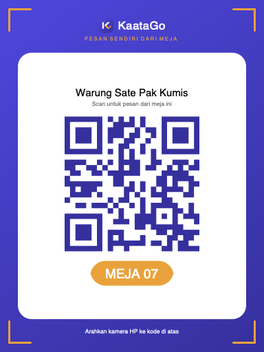

# MerchantPOS — Specification Document (FSD + TSD)

**Versi aplikasi:** 1.34.0 (build 72)
**Tanggal:** 14 Agustus 2026
**Status:** acuan pengujian (UAT & regression)

Dokumen ini menggabungkan sisi fungsional (apa yang dilakukan aplikasi,
aturannya, validasinya) dan sisi teknis (bagaimana itu dijalankan, di
mana datanya, apa yang dijaga database). Yang tertulis di sini diambil
dari kode yang berjalan, bukan dari rencana — kalau ada beda antara
dokumen ini dan aplikasi, itu temuan yang layak dilaporkan.

---

## Daftar Isi

1. [Ringkasan Sistem](#1-ringkasan-sistem)
2. [Peran & Hak Akses](#2-peran--hak-akses)
3. [Arsitektur Teknis](#3-arsitektur-teknis)
4. [Alur Utama](#4-alur-utama)
5. [Spesifikasi Fungsional per Modul](#5-spesifikasi-fungsional-per-modul)
6. [Aturan Validasi Isian](#6-aturan-validasi-isian)
7. [Aturan Bisnis: Pajak, Jurnal, Saldo](#7-aturan-bisnis-pajak-jurnal-saldo)
8. [Daftar Status](#8-daftar-status)
9. [Notifikasi](#9-notifikasi)
10. [Prasyarat Database](#10-prasyarat-database)
11. [Tangkapan Layar](#11-tangkapan-layar)
12. [Fitur dalam Pengembangan & Batasan Diketahui](#12-fitur-dalam-pengembangan--batasan-diketahui)
13. [Matriks Pengujian Ringkas](#13-matriks-pengujian-ringkas)

---

## 1. Ringkasan Sistem

MerchantPOS adalah aplikasi kasir (POS) sekaligus self-order untuk rumah
makan di Indonesia. Satu aplikasi dipakai dua kelompok orang yang sangat
berbeda:

- **Pelanggan** — memindai QR di meja atau memilih resto dari daftar,
  memesan dari HP sendiri, lalu membayar QRIS atau tunai di kasir.
- **Karyawan resto** — kasir, dapur, admin, keuangan, dan pemilik, yang
  masing-masing melihat menu berbeda begitu masuk.

Sifat sistemnya:

| Sifat | Keterangan |
|---|---|
| Offline-first | Katalog produk & transaksi kasir punya salinan lokal (sqflite); pesanan bersama lewat Supabase |
| Multi-tenant | Satu basis data menampung banyak resto; setiap baris terikat `resto_id` |
| Multi-resto | Satu akun Admin/Finance/Owner bisa memegang beberapa cabang, berpindah lewat penukar resto di header |
| Realtime | Pesanan, setoran, dan top up disiarkan langsung ke layar yang menonton |
| Pembukuan otomatis | Setiap uang yang bergerak menghasilkan jurnal GL yang seimbang, ditulis trigger database — bukan aplikasi |

---

## 2. Peran & Hak Akses

Login **hanya lewat Google Sign-In**, dan alamatnya harus terdaftar di
tabel `employees` untuk peran karyawan. Pelanggan boleh sama sekali
tanpa akun (tamu).

### 2.1 Daftar peran

| Peran | Nilai DB | Lingkup |
|---|---|---|
| Super Admin | `super_admin` | Seluruh resto di MerchantPOS |
| Owner | `owner` | Semua resto miliknya |
| Admin | `admin` | Satu resto (atau beberapa, bila didaftarkan) |
| Kasir | `kasir` | Satu resto |
| Chef | `chef` | Satu resto |
| Finance | `finance` | Satu resto (atau beberapa) |
| Customer | — | Tanpa akun karyawan |

### 2.2 Matriks menu

| Menu | Super Admin | Owner | Admin | Kasir | Chef | Finance | Customer |
|---|:--:|:--:|:--:|:--:|:--:|:--:|:--:|
| Kasir / Input Pesanan | – | ✔ | ✔ | ✔ | – | – | – |
| Pesanan Masuk | – | ✔ | ✔ | – | – | – | – |
| Layar Dapur | – | ✔ | – | – | ✔ | – | – |
| **Pending Payment** | – | ✔ | ✔ | ✔ | – | – | – |
| Riwayat Transaksi | – | ✔ | ✔ | ✔ | – | – | – |
| Pemasukan | – | ✔ | – | – | – | ✔ | – |
| Saldo & Pengeluaran | – | ✔ | ✔ | ✔ | – | ✔ | – |
| Setor Saldo Cash | – | ✔ | ✔ | ✔ | – | ✔ | – |
| Mapping GL Account | – | ✔ | – | – | – | ✔ | – |
| Jurnal GL | – | ✔ | – | – | – | ✔ | – |
| Laporan Transaksi | – | ✔ | – | – | – | ✔ | – |
| Kelola Produk | – | ✔ | ✔ | – | – | – | – |
| Pengaturan (Info Resto, Banner, QR Meja) | – | ✔ | ✔ | – | – | – | – |
| Pengaturan Pembayaran | – | ✔ | – | – | – | ✔ | – |
| Kelola Karyawan | ✔ | ✔ | ✔ | – | – | – | – |
| List Resto | ✔ | – | – | – | – | – | – |
| Kirim Pengumuman | ✔ | – | – | – | – | – | – |
| Kotak Masuk | ✔ | ✔ | ✔ | ✔ | ✔ | ✔ | – |
| Pesan / Profil / Riwayat | – | – | – | – | – | – | ✔ |

### 2.3 Aturan persetujuan (penting untuk diuji)

> **Yang mengajukan tidak boleh menyetujui.** Kasir dan Admin
> **mengajukan** setoran tunai dan top up petty cash. Finance dan Owner
> yang **memutuskan**. Aturan ini ditegakkan dua kali: tombolnya
> disembunyikan di aplikasi, dan kebijakan RLS menolaknya di database.

**Kasus uji wajib:** login sebagai Kasir → buat pengajuan top up →
pastikan tombol *Setuju*/*Tolak* **tidak muncul** pada barisnya sendiri.

---

## 3. Arsitektur Teknis

### 3.1 Tumpukan teknologi

| Lapis | Teknologi | Versi |
|---|---|---|
| Aplikasi | Flutter | 3.24.5 (dipatok) |
| Bahasa | Dart | SDK ^3.5.4 |
| State | `provider` | ^6.1.2 |
| DB lokal | `sqflite` | ^2.3.3 |
| Backend | Supabase (Postgres + Auth + Realtime + RLS) | ^2.6.0 |
| Login | `google_sign_in` | ^6.2.1 |
| Pemindai QR | `mobile_scanner` | ^5.2.3 |
| Notifikasi | `flutter_local_notifications` | 19.5.0 |
| Cetak / PDF | `pdf` + `printing` | ^3.11.1 / ^5.13.4 |
| Simpan galeri | `gal` | ^2.3.0 |
| Lokasi | `geolocator` | **13.0.4 (dipatok)** |
| Geocoding | Nominatim (OpenStreetMap) — gratis, tanpa kunci API | — |

> `geolocator` **tidak boleh** dinaikkan ke 14.x: versinya memanggil
> `Color.toARGB32` yang baru ada di Flutter 3.27+. `flutter analyze`
> tidak menangkapnya karena kerusakannya ada di dalam dependensi.

### 3.2 Tabel utama

| Tabel | Isi | Disiarkan realtime |
|---|---|:--:|
| `restaurants` | Data resto, tarif PPN/service, lokasi | ✔ |
| `employees` | Akun karyawan; PK `id` (uuid), unik `(email, resto_id)` | – |
| `products`, `categories` | Katalog per resto | ✔ |
| `orders` | Pesanan bersama (kasir & pelanggan) | ✔ |
| `sessions` | Sesi meja pelanggan | ✔ |
| `settings` | QRIS & rekening bank per resto | ✔ |
| `gl_accounts` | Pemetaan metode bayar → nomor GL | – |
| `gl_journal_entries` | Buku besar, hanya-tambah | – |
| `expenses` | Pengeluaran dari petty cash | – |
| `petty_cash_entries` | Top up petty cash + statusnya | ✔ (sejak 1.34.0) |
| `cash_deposits` | Setoran tunai + bukti + statusnya | ✔ (sejak 1.34.0) |
| `announcements` | Pengumuman ke kotak masuk | – |
| `promo_banners` | Banner promo di halaman menu | – |

### 3.3 Keamanan baris (RLS)

Semua akses karyawan melewati satu fungsi:

```
is_resto_employee(resto_id, roles[])
```

Owner lolos setiap pemeriksaan peran lewat satu klausa di dalam fungsi
itu — bukan dengan menambahkan `'owner'` ke setiap daftar peran di
seluruh kebijakan.

| Tabel | Baca | Tulis |
|---|---|---|
| `orders` | Publik (tamu harus bisa melihat pesanannya) | Insert publik; update `admin`/`kasir`/`chef` (+owner); delete `admin` |
| `gl_journal_entries` | `admin`, `finance` (+owner) | **Tidak ada** — hanya trigger `SECURITY DEFINER` |
| `cash_deposits`, `petty_cash_entries` | Karyawan resto ybs | Insert oleh pengaju; update status hanya Finance/Owner |

> Jurnal sengaja tidak punya kebijakan tulis untuk peran mana pun. Itu
> yang membuat buku besar tidak bisa menyimpang dari kejadian yang
> sebenarnya di `orders`/`expenses`.

---

## 4. Alur Utama

### 4.1 Pelanggan pesan sendiri — bayar QRIS


### 4.2 Pelanggan pesan sendiri — bayar tunai di kasir *(baru di 1.34.0)*


**Titik uji paling penting:** setelah pembayaran disimpan, pesanan
**tidak boleh** ada di dua daftar sekaligus, dan **tidak boleh** hilang
dari keduanya.

### 4.3 Setor saldo tunai & persetujuannya


### 4.4 Top up petty cash & persetujuannya


Alurnya sama dengan 4.3, dengan perbedaan:

- Perantaranya **GL Suspense Petty Cash**, bukan GL Suspense biasa.
- Tombolnya berbunyi **Setuju** / **Tolak** (setoran tunai:
  **Konfirmasi** / **Tolak**).
- Top up yang dibuat Finance/Owner sendiri **langsung berstatus
  Completed** — tidak ada gunanya menyetujui permintaan sendiri.

### 4.5 Dapur


Notifikasi berbunyi di HP pelanggan saat masuk **Diproses** dan
**Selesai**; di HP kasir untuk pesanan yang dia input sendiri.

---

## 5. Spesifikasi Fungsional per Modul

### 5.1 Pending Payment *(baru di 1.34.0)*

**Akses:** Kasir, Admin, Owner.

| # | Fungsi | Perilaku yang diharapkan |
|---|---|---|
| F-PP-01 | Daftar antrean | Menampilkan **hanya** pesanan dengan `source = customer` **dan** `payment_status = pending` **dan** `payment_method = cash`, terbaru di atas |
| F-PP-02 | Header ringkasan | Menampilkan jumlah pesanan dan total nominal yang menunggu |
| F-PP-03 | Detail pesanan | Popup berisi nomor pesanan, meja/Take Away, waktu, nama pemesan, rincian item beserta catatan, biaya service, PPN, dan total |
| F-PP-04 | Terima pembayaran | Dialog uang diterima + kembalian, sama persis dengan checkout kasir |
| F-PP-05 | Tombol dikunci saat proses | Selama satu pesanan diproses, tombol pesanan lain ikut nonaktif — mencegah pelunasan ganda |
| F-PP-06 | Keluar dari antrean | Setelah lunas, barisnya hilang **tanpa perlu refresh** (stream realtime) |
| F-PP-07 | Masuk riwayat | Muncul di Riwayat Transaksi Kasir/Admin/Owner dan ikut dihitung pada total harian |
| F-PP-08 | Keadaan kosong | Menampilkan "Tidak ada pesanan yang menunggu dibayar" |
| F-PP-09 | Penanda merah | Kartu menu membawa bulatan merah berisi jumlah antrean; hilang saat nol |

**Negatif yang wajib diuji:**

- Pesanan QRIS yang belum dibayar **tidak boleh** muncul di sini.
- Pesanan yang diinput kasir **tidak boleh** muncul di sini.
- Uang diterima < total → tombol *Terima Pembayaran* nonaktif dan label
  berubah jadi **Kurang**.

### 5.2 Generator QR Meja

| # | Fungsi | Perilaku yang diharapkan |
|---|---|---|
| F-QR-01 | Mode Satu Meja | Isi nomor meja bebas ("7", "A01", "VIP-2"); pratinjau berubah seketika |
| F-QR-02 | Mode Banyak Meja | Awalan opsional + rentang dari–sampai; maksimal **100** sekali jalan |
| F-QR-03 | Nol di depan | Rentang 8–12 menghasilkan `08`…`12`, mengikuti panjang nomor terbesar |
| F-QR-04 | Pratinjau borongan | Hanya meja pertama digambar penuh; sisanya sebagai daftar nomor |
| F-QR-05 | Simpan ke galeri | Masuk album **MerchantPOS**; label tombol "Simpan ke Galeri" (satu) / "Download Semua (N)" |
| F-QR-06 | Penghitung proses | Tombol berubah jadi "Menyimpan 12/30…" selama proses borongan |
| F-QR-07 | Bagikan & Cetak | Share sheet dan dialog cetak, satu meja satu halaman |
| F-QR-08 | Isi payload | Tetap `RESTO:<restoId>|TABLE:<n>` — **tidak boleh berubah**, pemindai pelanggan bergantung padanya |

**Negatif:** rentang terbalik (9→3), nomor awal 0, dan rentang > 100
harus memunculkan pesan dan mematikan seluruh tombol.

### 5.3 Setor Saldo Cash

| # | Fungsi | Perilaku |
|---|---|---|
| F-SD-01 | Ajukan setoran | Nominal, nama bank, nomor rekening, atas nama, catatan, foto bukti (opsional) |
| F-SD-02 | Popup konfirmasi | "Pastikan nominal di Saldo Rekening anda sudah sesuai dengan nominal yang di transfer" |
| F-SD-03 | Status | Pending → **Completed** / Ditolak |
| F-SD-04 | Tombol Finance | **Konfirmasi** dan **Tolak** |
| F-SD-05 | Uang saat pending | Sudah keluar dari Saldo Cash, mengendap di GL Suspense |
| F-SD-06 | Uang saat ditolak | **Kembali** dari GL Suspense ke Saldo Cash |
| F-SD-07 | Lihat bukti | Foto bisa dibuka besar |
| F-SD-08 | Penanda merah | Jumlah pending tampil di kartu menu Finance/Owner |

### 5.4 Saldo & Pengeluaran (termasuk Petty Cash)

| # | Fungsi | Perilaku |
|---|---|---|
| F-SP-01 | Kartu saldo total | Penghasilan + Petty Cash + Setoran − Pengeluaran |
| F-SP-02 | Pemisahan Cash / Non Cash | Angka tunai harus cocok dengan isi laci saat tutup toko |
| F-SP-03 | Ajukan/Top Up petty cash | Label tombol **Ajukan Top Up** untuk Kasir/Admin, **Top Up** untuk Finance/Owner |
| F-SP-04 | Sumber top up | Top Up Manual, Withdraw dari Saldo Cash, Withdraw dari Saldo Non Cash |
| F-SP-05 | Pengelompokan per tanggal | Semua expand/collapse **default tertutup**… |
| F-SP-06 | …kecuali hari yang menunggu | Tanggal yang menyimpan pengajuan **terbuka sendiri** dan diberi penanda merah |
| F-SP-07 | Catat pengeluaran | Selalu diambil dari petty cash; dibatasi saldo yang tersedia |
| F-SP-08 | Popup detail jurnal | Ketuk baris mana pun membuka jurnal GL di baliknya |
| F-SP-09 | Tombol tidak menutup data | Tombol aksi berbentuk pil di samping judul bagian, bukan FAB mengambang |

### 5.5 Kotak Masuk

| # | Fungsi | Perilaku |
|---|---|---|
| F-IN-01 | Penanda belum dibaca | Bulatan merah berisi jumlah pesan belum dibaca di kartu menu |
| F-IN-02 | Subtitle | "N pesan belum dibaca" saat ada, keterangan biasa saat kosong |
| F-IN-03 | Muat ulang | Angkanya dihitung ulang saat kembali dari layar kotak masuk |
| F-IN-04 | Per email | Pengumuman ditujukan per alamat email penerima |

### 5.6 Lokasi Resto

| # | Fungsi | Perilaku |
|---|---|---|
| F-LK-01 | Ambil titik lokasi | Tombol "Lokasi Saya" di Info Resto; izin diminta saat itu, bukan saat aplikasi dibuka |
| F-LK-02 | Alamat otomatis | Reverse geocoding lewat Nominatim (gratis, tanpa kunci API) |
| F-LK-03 | Buka di Maps | Pelanggan bisa membuka lokasi resto di Google Maps |
| F-LK-04 | Tanpa pelacakan | Tidak ada pengambilan lokasi di latar belakang |

### 5.7 Kasir / Input Pesanan

| # | Fungsi | Perilaku |
|---|---|---|
| F-KS-01 | Pilih produk | Grid produk per kategori, stok berkurang saat checkout |
| F-KS-02 | Baris per varian | Satu produk dengan level berbeda tetap jadi baris terpisah |
| F-KS-03 | Hapus dari keranjang | Menu yang telanjur ditambahkan bisa dibatalkan |
| F-KS-04 | Metode bayar | Tunai / QRIS / Transfer |
| F-KS-05 | Pembayaran tunai | Dialog uang diterima + kembalian + saran nominal ("Uang pas", pembulatan ke atas) |
| F-KS-06 | Struk | Bisa disimpan ke galeri, dibagikan, dan dicetak |
| F-KS-07 | Cetak ulang | Struk transaksi lama bisa ditampilkan ulang dari Riwayat Transaksi |

---

## 6. Aturan Validasi Isian

Semua aturan di bawah berlaku **sama di seluruh layar**, ditulis satu
kali di `lib/utils/field_rules.dart`. Tiap aturan dipasang **dua lapis**:

- **Formatter** — menahan karakter terlarang saat diketik.
- **Validator** — memeriksa lagi saat disimpan, menangkap isian yang
  masuk lewat *paste* atau papan ketik yang mengabaikan formatter.

> **Kasus uji wajib:** setiap kolom harus diuji dengan **tempel (paste)**,
> bukan hanya diketik. Lapis kedua ada justru untuk itu.

### 6.1 Tabel aturan

| Jenis | Maks | Karakter diizinkan | Aturan tambahan | Pesan galat |
|---|:--:|---|---|---|
| **Nama** (orang, resto, produk, bank) | **40** | Huruf, angka, spasi, `. , ' ( ) & / -` | Wajib (kecuali dinyatakan opsional) | "… wajib diisi" · "… maksimal 40 karakter" · "… hanya boleh huruf, angka, dan tanda baca biasa" |
| **Nomor HP** | **15** | Angka saja | Minimal **8** angka. Tanda `+` **tidak** diizinkan | "… hanya boleh angka" · "… maksimal 15 angka" · "… terlalu pendek" |
| **Email** | **25** | Huruf, angka, `@ . _ -` | **Wajib `@gmail.com`** | "Harus alamat @gmail.com" · "Email maksimal 25 karakter" · "Alamat email belum lengkap" |
| **NIP** | **15** | Angka saja | Opsional; tanpa batas bawah | "NIP hanya boleh angka" · "NIP maksimal 15 angka" |
| **Nomor rekening** | **20** | Angka saja | — | "Nomor rekening hanya boleh angka" · "Nomor rekening maksimal 20 angka" |
| **Tarif %** (PPN, service) | **6** | Angka, `.` `,` | Format `\d{1,3}(\.\d{1,2})?`; rentang **0–100**; koma dibaca sebagai desimal; kosong = 0 | "… harus angka, mis. 11 atau 12.50" · "… harus antara 0 dan 100" |
| **Harga produk** | — | Angka (pemisah ribuan otomatis) | Wajib | "Wajib diisi, angka" |
| **Stok** | — | Angka | Wajib | "Wajib diisi" · "Harus angka" |
| **Awalan QR meja** | **6** | Bebas | Opsional | — |
| **Rentang nomor meja** | **4** digit | Angka saja | 1 ≤ dari ≤ sampai; maks 100 baris | "Nomor awal minimal 1" · "Nomor akhir harus lebih besar dari nomor awal" · "Maksimal 100 meja sekali buat" |

### 6.2 Alasan di balik aturan yang mudah dikira bug

| Aturan | Alasan |
|---|---|
| Email **wajib Gmail** | Satu-satunya cara masuk adalah Login dengan Google. Alamat non-Gmail akan tersimpan rapi lalu gagal login **tanpa penjelasan apa pun** |
| Nomor HP **tanpa `+`** | Nomor Indonesia ditulis mulai `0` atau `62`. Mengizinkan `+` berarti nomor yang sama tersimpan dalam dua bentuk yang tidak bisa dicocokkan |
| Tarif menolak `11.` | `double.tryParse("11.")` menghasilkan 11 dan lolos begitu saja; regexnya yang menahannya |
| Emoji ditolak pada nama | Nama dipakai di struk dan PDF, yang fontnya tidak memuat emoji |

### 6.3 Perilaku pesan galat

**Pesan galat harus muncul di depan dialog input**, bukan di belakangnya.
Seluruh notifikasi singkat memakai lapisan *overlay* pada navigator akar
(`AppToast`), bukan `SnackBar` yang hidup di lapisan `Scaffold`.

**Kasus uji:** buka dialog mana pun yang bisa gagal (mis. Tambah
Karyawan dengan email ganda) → pesan galatnya wajib terlihat penuh di
atas dialog.

---

## 7. Aturan Bisnis: Pajak, Jurnal, Saldo

### 7.1 Perhitungan pajak

```
service = base × service%
ppn     = (base + service) × ppn%
total   = base + service + ppn
```

| Aturan | Keterangan |
|---|---|
| PPN dikenakan atas **base + service** | Biaya service sendiri kena PPN. Menghitung dari base saja membuat laporan kurang beberapa ratus rupiah per nota — kecil sampai harus dicocokkan dengan pelaporan pajak |
| Harga menu = **base + PPN saja** | Service adalah biaya per-nota yang hanya berlaku Dine In |
| Take Away | **Tidak kena service**, tetap kena PPN. Totalnya harus **sama persis** dengan harga menu |
| Produk bebas PPN | Bisa ditandai per produk (`ppn_exempt`) |
| Tarif disimpan di | **Finance → Mapping GL Account**, bukan di pengaturan resto |

**Kasus uji angka:** base 55.000, service 5%, PPN 11% →
service 2.750, PPN (55.000+2.750)×11% = 6.353, total **64.103**.
Ketiga komponen harus selalu berjumlah persis sama dengan total.

### 7.2 Konvensi jurnal

> **Kredit = uang masuk ke akun. Debit = uang keluar dari akun.**

Ini kebalikan dari konvensi akuntansi aset pada umumnya, dan disengaja
agar seluruh aplikasi memakai satu arah yang sama. Penjualan mengkredit
akun pendapatan.

| Kejadian | Debit | Kredit |
|---|---|---|
| Pesanan lunas | — | GL metode bayar (Tunai/QRIS/Transfer), GL PPN, GL Service |
| Setor tunai diajukan | Saldo Cash | GL Suspense |
| Setor tunai dikonfirmasi | GL Suspense | GL Total Saldo |
| Setor tunai ditolak | GL Suspense | Saldo Cash |
| Top up petty diajukan | GL sumber | GL Suspense Petty Cash |
| Top up petty disetujui | GL Suspense Petty Cash | GL Petty Cash |
| Top up petty ditolak | GL Suspense Petty Cash | GL sumber |
| Pengeluaran | GL Petty Cash | GL biaya |

**Kasus uji:** setiap transaksi harus menghasilkan jurnal yang
**seimbang** (total debit = total kredit), dan pembatalan harus
mengembalikan uangnya ke GL asal — **tidak boleh menyangkut di
Suspense**.

### 7.3 Daftar GL account

`cash`, `qris`, `transfer`, `petty_cash`, `income_aggregate`,
`total_balance`, `ppn`, `service`, `suspense`, `suspense_petty`.

### 7.4 Pemetaan metode bayar → GL

| `payment_method` pada pesanan | GL |
|---|---|
| `cash` / `Tunai` | GL cash |
| `qris` / `QRIS` | GL qris |
| `transfer` / `Transfer` | GL transfer |
| kosong **dan** `source = customer` | GL qris *(pesanan lama)* |
| kosong **dan** `source = kasir` | GL cash |

> **Perubahan 1.34.0.** Sebelumnya **setiap** pesanan pelanggan dipetakan
> ke QRIS tanpa melihat cara bayarnya. Kini cara bayar yang disebut
> pesanannya yang menang. **Regresi yang wajib diuji:** pesanan tunai
> dari HP pelanggan harus masuk **GL Tunai** dan **Saldo Cash**, bukan
> QRIS.

### 7.5 Riwayat Transaksi — siapa yang masuk

Yang menentukan bukan siapa yang mengetik pesanannya, tapi **apakah
uangnya lewat laci kasir**.

| Pesanan | Masuk Riwayat Transaksi? |
|---|:--:|
| Diinput Kasir/Admin (metode apa pun) | ✔ |
| Pelanggan, tunai, **sudah dibayar** di kasir | ✔ |
| Pelanggan, tunai, **belum dibayar** | ✘ (ada di Pending Payment) |
| Pelanggan, QRIS | ✘ (uangnya langsung ke rekening) |

---

## 8. Daftar Status

### 8.1 Status pembayaran pesanan

| Nilai DB | Label | Arti |
|---|---|---|
| `pending` | **Menunggu Pembayaran** | Pesanan sudah masuk, uangnya belum |
| `paid` | **Sudah Dibayar** | Lunas; jurnal sudah tercatat |

### 8.2 Status dapur

| Nilai DB | Label | Dipicu oleh |
|---|---|---|
| `waiting` | **Baru** | Pesanan masuk |
| `onProgress` | **Diproses** | Dapur mencentang sebagian item |
| `done` | **Selesai** | Seluruh item tercentang |

### 8.3 Status setoran & top up

| Nilai DB | Label setoran | Label petty cash |
|---|---|---|
| `pending` | Pending | Pending |
| `approved` | **Completed** | **Completed** |
| `rejected` | Ditolak | Ditolak |

> Finance tidak "menyetujui permintaan" pada setoran — dia **memastikan
> uangnya benar-benar masuk rekening**. Karena itu istilahnya
> *konfirmasi*, dan hasilnya *Completed*, bukan *Disetujui*.

---

## 9. Notifikasi

### 9.1 Kanal Android

| Kanal | Nama | Untuk |
|---|---|---|
| `kaata_order_status` | Status Pesanan | Pelanggan & kasir — pesanan mulai dimasak / siap |
| `kaata_new_order` | Pesanan Baru | Dapur — pesanan masuk |
| `kaata_fund_review` | **Hasil Pengajuan** | Kasir & admin — setoran/top up sudah diputus |

Dipisah per kanal supaya bisa dibisukan sendiri-sendiri lewat Setelan
Android. Kasir yang membisukan hiruk-pikuk pesanan tetap mendengar kabar
soal uang yang dia pertanggungjawabkan.

### 9.2 Aturan siapa dikabari

| Peran | Dikabari saat |
|---|---|
| Pelanggan | Pesanannya sendiri masuk Diproses / Selesai |
| Dapur | Ada pesanan baru masuk |
| Kasir | Pesanan **yang dia input sendiri** mulai dimasak / siap |
| Kasir & Admin | Setoran/top up **yang dia ajukan sendiri** diputus Finance |

**Tidak ada gema:** yang memutuskan tidak diberi tahu soal keputusannya
sendiri; yang membuat pesanan tidak diberi tahu soal pesanan yang baru
saja dia buat.

### 9.3 Hal teknis yang pernah jadi bug senyap

- Ikon kecil notifikasi **harus** ada di folder `drawable` dengan nama
  polos (`ic_notification`). Plugin mencarinya lewat
  `getIdentifier(name, "drawable", package)` — nama seperti
  `@mipmap/ic_launcher` menghasilkan id 0 dan Android **menolak
  notifikasinya tanpa pesan apa pun**.
- Potret pertama dari stream sengaja **tidak** membunyikan apa pun. Saat
  aplikasi dibuka, seluruh riwayat datang sekaligus; tanpa penjagaan ini
  HP berbunyi berkali-kali untuk kejadian kemarin.

**Kasus uji:** buka aplikasi setelah lama tertutup → **tidak boleh** ada
notifikasi beruntun untuk pesanan/pengajuan lama.

---

## 10. Prasyarat Database

Berkas SQL dijalankan di **SQL Editor Supabase**, berurutan, dan semuanya
aman dijalankan berulang kali.

| Berkas | Wajib untuk | Gejala kalau belum dijalankan |
|---|---|---|
| `supabase/customer_cash_payment.sql` | 1.34.0 | Pelunasan tunai gagal (kolom `cash_received` tidak ada); notifikasi hasil pengajuan **tidak pernah bunyi** |
| `supabase/employee_surrogate_key.sql` | Edit email karyawan | Email karyawan tidak bisa diubah |
| `supabase/promo_banner.sql` | Banner promo | Menu Banner Promo gagal memuat |
| `supabase/rilis_setor_petty_inbox.sql` | Setor, petty cash, inbox | Uang tersangkut di GL Suspense saat pengajuan ditolak |

> `rilis_setor_petty_inbox.sql` perlu **dijalankan ulang**: seluruh isinya
> satu transaksi, jadi galat batasan di tengah berkas ikut membatalkan
> perbaikan arah jurnal yang ada di dalamnya.

---

## 11. Tangkapan Layar

### 11.1 Yang sudah tersedia di repositori

| Berkas | Isi |
|---|---|
| `docs/gambar/logo-merchantpos.png` | Lambang MerchantPOS 1.34.0 — monogram K berpanah |
| `docs/gambar/qr-meja-kartu.png` | Kartu QR Meja hasil render sebenarnya (bukan mockup) |




### 11.2 Yang masih perlu diambil dari perangkat

Kedua gambar di atas dihasilkan langsung dari kode (perender ikon dan
perender kartu QR). **Tangkapan layar aplikasi yang berjalan belum ada di
dokumen ini** — mengambilnya butuh perangkat/emulator yang sudah login ke
akun Supabase dengan data resto yang terisi, dan itu tidak bisa
dihasilkan dari kode.

Daftar berikut adalah layar yang perlu ditangkap saat pengujian, dengan
nama berkas yang disarankan supaya konsisten. Simpan ke `docs/gambar/`.

| No | Layar | Nama berkas | Peran |
|---|---|---|---|
| 01 | Pilih peran (Customer / Resto) | `01-pilih-peran.png` | — |
| 02 | Beranda Customer | `02-customer-beranda.png` | Customer |
| 03 | Scan QR meja | `03-customer-scan.png` | Customer |
| 04 | Halaman menu + banner promo | `04-customer-menu.png` | Customer |
| 05 | Popup pilih level/varian | `05-customer-varian.png` | Customer |
| 06 | Keranjang + **pilihan QRIS/Tunai** | `06-customer-keranjang.png` | Customer |
| 07 | Layar QRIS | `07-customer-qris.png` | Customer |
| 08 | **Layar menunggu pembayaran (tunai)** | `08-customer-bayar-kasir.png` | Customer |
| 09 | Status pesanan | `09-customer-status.png` | Customer |
| 10 | Hub Kasir + **penanda merah** | `10-kasir-hub.png` | Kasir |
| 11 | **Pending Payment — daftar** | `11-pending-payment.png` | Kasir |
| 12 | **Pending Payment — detail** | `12-pending-detail.png` | Kasir |
| 13 | **Dialog terima pembayaran** | `13-terima-pembayaran.png` | Kasir |
| 14 | Riwayat Transaksi | `14-riwayat-transaksi.png` | Kasir |
| 15 | Setor Saldo Cash — form | `15-setor-form.png` | Kasir |
| 16 | Setor Saldo Cash — daftar + status | `16-setor-daftar.png` | Finance |
| 17 | Hub Finance + **penanda merah** | `17-finance-hub.png` | Finance |
| 18 | Saldo & Pengeluaran | `18-saldo.png` | Finance |
| 19 | **Petty cash — tanggal berpenanda** | `19-petty-penanda.png` | Finance |
| 20 | Popup detail jurnal | `20-jurnal-detail.png` | Finance |
| 21 | Mapping GL Account | `21-mapping-gl.png` | Finance |
| 22 | Layar Dapur — 3 tab | `22-dapur.png` | Chef |
| 23 | **QR Meja — mode satu meja** | `23-qr-satu.png` | Admin |
| 24 | **QR Meja — mode banyak meja** | `24-qr-banyak.png` | Admin |
| 25 | Info Resto + lokasi | `25-info-resto.png` | Admin |
| 26 | Kelola Karyawan | `26-karyawan.png` | Admin |
| 27 | Kotak Masuk + **penanda merah** | `27-inbox.png` | semua |
| 28 | Notifikasi hasil pengajuan (banner) | `28-notif-approval.png` | Kasir |
| 29 | Hub Owner | `29-owner-hub.png` | Owner |
| 30 | Penukar resto (multi-resto) | `30-switch-resto.png` | Owner |

---

## 12. Fitur dalam Pengembangan & Batasan Diketahui

### 12.1 Sengaja belum sungguhan

| Hal | Keadaan sekarang |
|---|---|
| **Pembayaran QRIS** | **Simulasi.** Kode QR-nya dibangkitkan dari data merchant, tapi tidak terhubung ke penyedia pembayaran mana pun. Tombolnya berbunyi "Simulasikan: Sudah Dibayar" |
| **Transfer bank** | Tidak ada pencocokan otomatis dengan mutasi bank; Finance yang memastikan |
| **Struk email** | Dihapus. Dulu mengantre baris untuk Edge Function dan penyedia surel yang tidak pernah dipasang, sehingga melaporkan berhasil padahal tidak ada yang terkirim. Diganti share sheet |

### 12.2 Batasan yang perlu diketahui penguji

| Batasan | Dampak |
|---|---|
| **Font struk & QR butuh internet** | `PdfGoogleFonts` mengunduh font saat merender. Dalam keadaan benar-benar luring, struk dan kartu QR jatuh ke Helvetica (bentuknya tetap benar) |
| **Penanda merah bukan realtime** | Angka di kartu menu dimuat saat hub dibuka dan saat kembali dari layarnya — bukan dipantau terus-menerus. Perubahan dari perangkat lain baru terlihat setelah masuk-keluar menu |
| **Penanda kasir menghitung se-resto** | Kartu Setor/Saldo di hub Kasir dan Admin menghitung **seluruh** pengajuan pending resto itu, termasuk milik rekan seshift — bukan hanya miliknya sendiri |
| **Nomor meja borongan berimbuhan nol** | Rentang 1–12 menghasilkan payload `TABLE:01`, bukan `TABLE:1`. Kalau penomoran meja di sistem lain tanpa nol, ini perlu disamakan |
| **Maksimal 100 QR sekali jalan** | Batas yang disengaja, bukan batas teknis |
| **Kembalian tidak disimpan** | Hanya `cash_received` yang disimpan; kembalian selalu dihitung ulang |
| **Reverse geocoding gratis** | Nominatim punya batas laju pemakaian wajar; pengambilan lokasi beruntun bisa ditolak sementara |

### 12.3 Riwayat perbaikan yang layak diregresi

Perbaikan berikut pernah menjadi bug nyata dan mudah kembali — masukkan
ke rangkaian uji regresi:

| # | Bug | Uji ulang |
|---|---|---|
| R-01 | Admin "forbidden" saat menyimpan Info Resto | Admin simpan Info Resto → harus berhasil |
| R-02 | Arah jurnal terbalik pada setoran & petty cash | Cek arah debit/kredit sesuai tabel 7.2 |
| R-03 | Uang tersangkut di GL Suspense saat ditolak | Tolak setoran → saldo kembali ke Saldo Cash |
| R-04 | Pesan galat tertutup dialog | Picu galat dari dalam dialog |
| R-05 | Tombol mengambang menutupi baris terakhir | Buka setiap layar berdaftar → baris terakhir harus terbaca penuh |
| R-06 | Email karyawan tidak bisa diubah | Edit email karyawan → harus tersimpan, riwayatnya tetap |
| R-07 | Katalog tercampur antar cabang | Owner pindah resto → produk & kategori harus ikut berganti |
| R-08 | Foto profil pelanggan tidak bisa dihapus | Hapus foto → harus benar-benar hilang |
| R-09 | Notifikasi diam total | Uji notifikasi ketiga kanal |
| R-10 | Pesanan tunai pelanggan masuk GL QRIS | Lihat 7.4 |

---

## 13. Matriks Pengujian

Matriks ringkas yang dulu ada di sini sudah **digantikan dokumen
tersendiri**: `TEST-CASE-KAATAGO` — 235 kasus uji berikut prioritas,
langkah, hasil yang diharapkan, dan rujukan ke ID kebutuhan FSD maupun
bab TSD.

Matriks lama disusun untuk versi 1.34.0 dan menyebut layar yang sudah
berganti nama sejak itu. Membiarkannya di sini berarti dua daftar
pengujian yang berbeda isinya, dan yang membacanya tidak punya cara tahu
mana yang berlaku.

---

*Dokumen ini disusun dari kode versi 1.34.0. Setiap perbedaan antara
dokumen dan aplikasi adalah temuan yang layak dilaporkan — bukan
kesalahan pembacaan penguji.*

---

## Cara membangun ulang dokumen ini

Berkas Word (`SPESIFIKASI-KAATAGO.docx`) **dihasilkan** dari berkas
Markdown ini, bukan diketik terpisah. Setelah mengubah isinya:

```
python3 -m pip install --user python-docx      # sekali saja
/usr/bin/python3 scripts/render_diagram_alur.py    # kalau diagramnya berubah
/usr/bin/python3 scripts/spesifikasi_ke_docx.py
```

Daftar isi di Word memakai *field* — buka dokumennya, klik kanan pada
daftar isi, lalu **Update Field** untuk memuat nomor halamannya.
