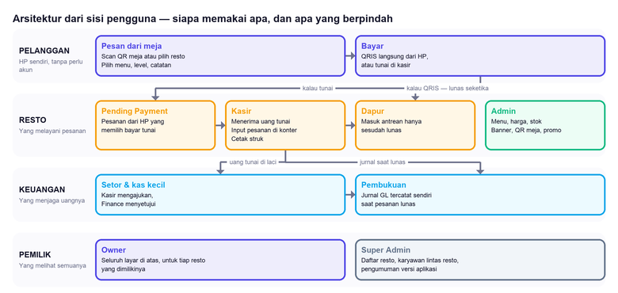
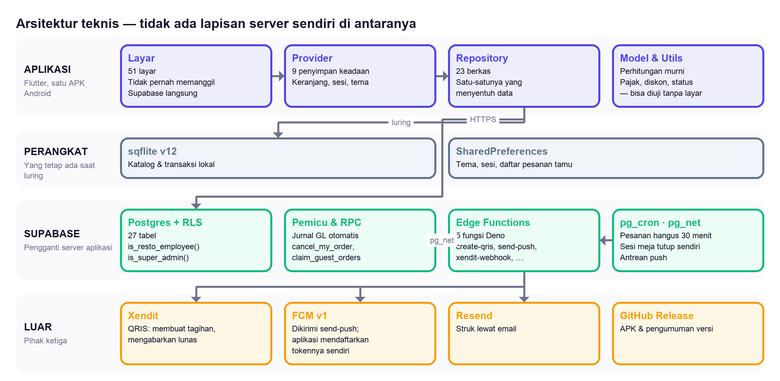
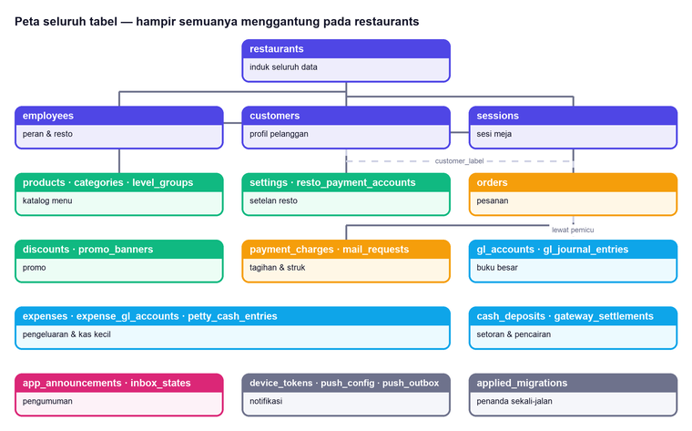
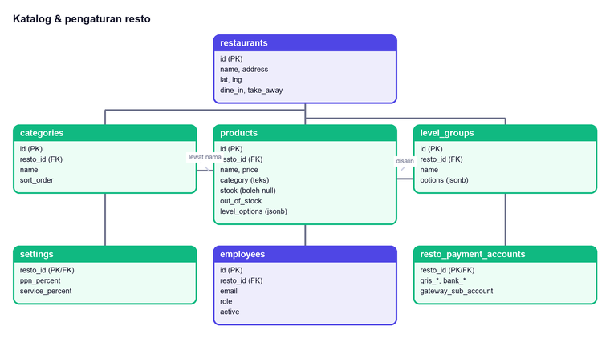
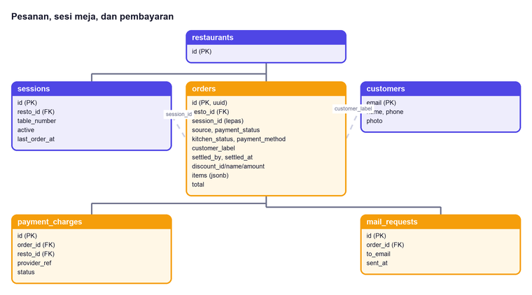
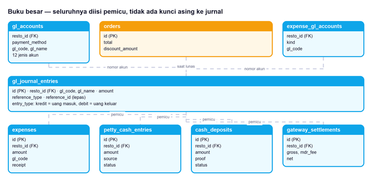
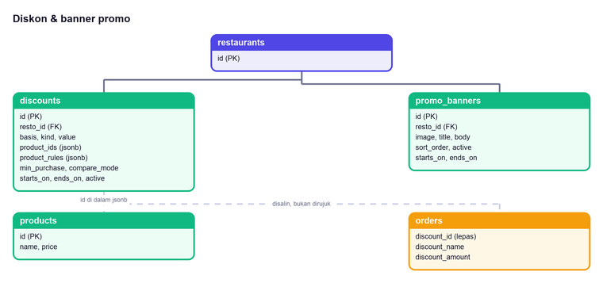
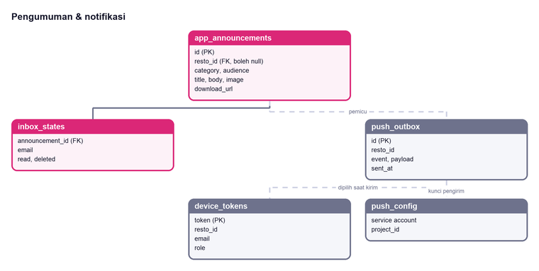

# MerchantPOS — Technical Specification Document

**Versi Aplikasi:** 2.16.0 (build 122)
**Versi Dokumen:** 1.9
**Tanggal Terbit:** 24 Agustus 2026
**Status:** Rilis
**Jenis Dokumen:** TSD — sisi teknis

Dokumen ini menjelaskan **bagaimana** MerchantPOS dibangun: lapisannya,
tabelnya, aturan keamanan barisnya, jalur uangnya di pembukuan, dan
keputusan-keputusan yang bentuknya tidak jelas dari kodenya sendiri.
Sisi fungsionalnya — siapa memakai apa, aturan bisnis apa yang berlaku —
ada di dokumen terpisah (`FSD-KAATAGO`).

Isinya diambil dari kode yang berjalan, bukan dari rencana. Setiap
perbedaan antara dokumen ini dan kodenya adalah temuan yang layak
dilaporkan.

---

## Daftar Isi

1. Gambaran Arsitektur
2. Tumpukan Teknologi
3. Struktur Kode
4. Model Data
5. Keamanan Baris (RLS)
6. Buku Besar (GL)
7. Pembayaran (termasuk langganan resto & voucher)
8. Notifikasi Push
9. Fungsi Edge
10. Penyimpanan Lokal & Luring
11. Migrasi Basis Data
12. Pengujian
13. Rilis & Distribusi
14. Utang Teknis yang Diketahui

---

## 1. Gambaran Arsitektur

Dua gambar untuk satu sistem yang sama, dari dua tempat berdiri yang
berbeda. Dipisah karena pembacanya berbeda: orang resto yang membaca
diagram berisi "pg_net" dan "RLS" tidak menemukan dirinya di sana, dan
pengembang yang membaca diagram berisi "Kasir menerima uang" tidak
menemukan tempat menambal kodenya. Satu gambar yang memuat keduanya
gagal untuk dua-duanya sekaligus.

### 1.1 Dari sisi pengguna



Tidak ada satu pun nama teknologi di gambar ini. Yang digambarkan adalah
apa yang berpindah tangan: pesanan, uang, dan catatannya.

Perhatikan dua jalur yang berbeda sesudah pelanggan memilih cara bayar.

**QRIS lunas seketika**, jadi pesanannya langsung masuk antrean dapur.
**Tunai tidak.** Ia mampir di Pending Payment, dan baru bergerak setelah
melewati Kasir — karena di situlah uangnya benar-benar berpindah tangan.
Kasir adalah titik yang tidak boleh dilompati: dari sanalah pesanannya
lanjut ke dapur, jurnal GL-nya tercatat, dan uang tunainya masuk ke laci
yang nanti disetorkan.

Bahan yang sudah terpakai adalah kerugian nyata, dan yang menanggungnya
bukan pihak yang menekan tombolnya di HP.

Satu hal lagi yang sering ditanyakan: **Owner tidak punya layar khusus
miliknya sendiri**; yang dia punya adalah seluruh layar di atasnya.

### 1.2 Dari sisi teknis



MerchantPOS adalah aplikasi Flutter tunggal yang berbicara langsung ke
Supabase. **Tidak ada server aplikasi milik sendiri di tengahnya.**

Yang menggantikannya adalah RLS — aturan keamanan yang hidup di
Postgres, bukan di kode aplikasi. Konsekuensinya harus diterima
sepenuhnya: **setiap aturan yang cuma dijaga aplikasi tidak dijaga sama
sekali.** Siapa pun yang memegang kunci publik proyek bisa memanggil
API-nya langsung, tanpa lewat layar mana pun. Karena itu tiap aturan
penting ditulis dua kali — di formulir supaya orangnya tahu, dan di
basis data supaya benar.

Perhatikan arah panah ke pihak ketiga. Yang **mengirim** ke Xendit,
FCM, dan Resend selalu fungsi edge, tidak pernah aplikasinya. Itu bukan
kerapian arsitektur melainkan syarat: kunci penyedia pembayaran yang
ditaruh di dalam APK sama saja dengan diumumkan, karena APK bisa
dibongkar siapa saja yang mengunduhnya.

Aplikasi tetap berhubungan dengan FCM untuk hal yang tidak butuh kunci
rahasia — mendaftarkan token perangkatnya sendiri dan menerima pesan
yang masuk. Yang tidak pernah dipegangnya adalah wewenang mengirim.

---

## 2. Tumpukan Teknologi

| Lapis | Pilihan | Versi |
|---|---|---|
| Bahasa | Dart | ^3.5.4 |
| Kerangka | Flutter | 3.24.5 (dipatok) |
| Kelola keadaan | `provider` | ^6.1.2 |
| Basis data lokal | `sqflite` | ^2.3.3 |
| Basis data pusat | Supabase (Postgres) | — |
| Klien | `supabase_flutter` | ^2.6.0 |
| Masuk | `google_sign_in` | ^6.2.1 |
| Push | `firebase_messaging` + `flutter_local_notifications` | ^15.2.10 / ^19.5.0 |
| Peta | `flutter_map` + OpenStreetMap | ^7.0.2 |
| Cetak | `pdf` + `printing` | ^3.11.1 / ^5.13.4 |
| Pindai QR | `mobile_scanner` | ^5.2.3 |

**Sasaran Android:** `com.gamskahfi.merchantpos`, minSdk 23, compileSdk 35.

> **Flutter dipatok, bukan mengikuti yang terbaru.** Versi Flutter
> menentukan versi Dart, dan versi Dart menentukan paket mana yang bisa
> dipakai. Membiarkannya bergerak sendiri berarti rilis bisa gagal
> karena hal yang sama sekali tidak disentuh siapa pun hari itu.

---

## 3. Struktur Kode

169 berkas Dart di `lib/`, dikelompokkan per peran, bukan per fitur.

| Folder | Isi | Jumlah |
|---|---|---|
| `screens/` | Layar, satu berkas satu layar | 51 |
| `widgets/` | Bagian yang dipakai lebih dari satu layar | — |
| `providers/` | Keadaan yang hidup lebih lama dari satu layar | 9 |
| `db/` | Repository — satu-satunya yang boleh menyentuh data | 23 |
| `models/` | Bentuk data berikut aturannya sendiri | — |
| `services/` | Push, unduhan, lokasi | — |
| `utils/` | Perhitungan murni | — |
| `l10n/` | Teks | — |

**Aturan lapisan:** layar tidak pernah memanggil Supabase langsung.
Selalu lewat repository. Yang menegakkan ini bukan alat, melainkan
kebiasaan — tapi pelanggarannya mudah terlihat karena `import
'package:supabase_flutter'` di dalam `screens/` menonjol.

**Perhitungan ditaruh di `models/` dan `utils/`, bukan di layar.** Bukan
demi kerapian: perhitungan yang hidup di dalam widget tidak bisa diuji
tanpa membangun seluruh layarnya, dan yang tidak bisa diuji dengan mudah
akhirnya tidak diuji. Rumus pajak, pemilihan diskon, dan penentuan
status semuanya fungsi biasa yang menerima angka dan mengembalikan
angka.

### 3.1 Provider yang ada

| Provider | Menyimpan |
|---|---|
| `AuthProvider` | Pengguna yang sedang masuk dan perannya |
| `AppPrefsProvider` | Tema dan bahasa, tersimpan di perangkat |
| `CartProvider` | Keranjang kasir |
| `CustomerCartProvider` | Keranjang pelanggan — terpisah, karena keduanya bisa hidup bersamaan |
| `ProductProvider` | Katalog resto yang sedang dibuka |
| `CategoryProvider` | Kategori |
| `LevelGroupProvider` | Kelompok varian |
| `SettingsProvider` | Info resto, tarif pajak |
| `TableSessionProvider` | Sesi meja hasil pindai QR |

---

## 4. Model Data

30 tabel, seluruhnya di skema `public`.

### 4.0 Peta relasi

Dipecah per wilayah, bukan satu diagram berisi 27 tabel sekaligus. Satu
gambar besar memang memuat semuanya, tapi pada lebar kertas tulisannya
jadi terlalu kecil untuk dibaca — dan diagram yang tidak terbaca sama
saja dengan tidak ada.

Dua jenis garis, dan bedanya bukan hiasan:

| Garis | Artinya |
|---|---|
| **Penuh** | Kunci asing sungguhan — database yang menegakkannya |
| **Putus** | Cuma kesepakatan — tidak ada yang mencegahnya dilanggar |

> **Yang putus adalah tempat data yatim bisa muncul.** Saat membaca
> kode, `order.session_id` dan `order.resto_id` terlihat sama persis —
> keduanya kolom berisi id. Bedanya baru terasa saat sesinya terhapus:
> `resto_id` ditolak database, `session_id` dibiarkan menunjuk ke
> sesuatu yang sudah tidak ada.



Menghapus sebuah resto menghapus seluruh isinya, dan itu memang yang
diinginkan. Yang perlu diingat: tidak ada satu pun tabel keuangan yang
kebal dari itu. Jurnal GL sebuah resto ikut hilang bersama restonya.



`products.category` menyimpan **nama** kategorinya, bukan id-nya. Itu
warisan dari sebelum tabel `categories` ada, dan akibatnya masih terasa:
mengganti nama kategori tidak ikut mengganti nama di produknya.



**Tidak ada tabel baris pesanan.** Isi pesanan disimpan sebagai jsonb di
`orders.items`. Itu keputusan yang disengaja: struk harus menyebut menu
persis seperti saat dipesan — nama, harga, dan level yang dipilih —
sementara menu di katalog boleh berubah besok. Baris pesanan yang
merujuk `products.id` akan ikut berubah bersama produknya, dan struk
lama jadi berbohong.

Harganya juga: yang tersimpan adalah harga saat itu, bukan rujukan ke
harga sekarang.



Seluruh panah ke `gl_journal_entries` putus, dan itu bukan kelalaian.
`reference_id` bisa menunjuk pesanan, pengeluaran, kas kecil, setoran,
atau pencairan — lima tabel berbeda, dibedakan `reference_type`. Satu
kolom tidak bisa berkunci asing ke lima tabel sekaligus.

Harganya adalah jurnal yang bisa menunjuk baris yang sudah terhapus.
Yang menutupi itu adalah fungsi pembalik: menghapus pengeluaran
menuliskan jurnal balikannya, bukan menghapus jurnal aslinya. Jurnal
tidak pernah dihapus — hanya ditambah.



`discounts` menunjuk produk lewat id **di dalam jsonb**, jadi tidak ada
yang mencegah promo menunjuk menu yang sudah dihapus. Promo semacam itu
tidak pernah mengenai apa pun dan tidak menimbulkan galat — ia hanya
diam.

Ke arah pesanan, hubungannya sengaja diputus: `orders.discount_amount`
adalah salinan, bukan rujukan. Aturan promonya boleh disunting atau
dihapus besok tanpa mengubah struk hari ini.



`inbox_states` memisahkan penanda "sudah dibaca" dari pengumumannya.
Satu pengumuman dibaca banyak orang pada waktu berbeda — menaruh
penandanya di barisnya sendiri berarti pengumuman itu hanya bisa
"sudah dibaca" oleh satu orang.

### 4.1 Daftar lengkap

| Tabel | Untuk apa |
|---|---|
| `restaurants` | Induk semuanya |
| `employees` | Karyawan berikut peran dan restonya |
| `customers` | Profil pelanggan yang punya akun |
| `sessions` | Sesi meja hasil pindai QR |
| `products` | Menu |
| `categories` | Kategori menu |
| `level_groups` | Kelompok varian (Level Pedas, Ukuran, …) |
| `orders` | Pesanan — pusat segalanya |
| `payment_charges` | Tagihan QRIS di sisi penyedia |
| `discounts` | Aturan promo |
| `promo_banners` | Banner di layar menu pelanggan |
| `settings` | Tarif pajak dan setelan resto |
| `resto_payment_accounts` | QRIS, rekening transfer, sub-akun gateway |
| `gl_accounts` | Nomor akun per resto per jenis |
| `gl_journal_entries` | Jurnal — satu baris satu pergerakan |
| `expenses` | Pengeluaran |
| `expense_gl_accounts` | Akun tujuan tiap jenis pengeluaran |
| `petty_cash_entries` | Kas kecil berikut alur persetujuannya |
| `cash_deposits` | Setoran tunai ke rekening |
| `gateway_settlements` | Pencairan penyedia berikut potongan MDR |
| `app_announcements` | Pengumuman — versi aplikasi maupun promo resto |
| `inbox_states` | Penanda sudah dibaca / terhapus, per orang |
| `device_tokens` | Token FCM tiap perangkat |
| `push_config` | Kunci dan setelan pengirim push |
| `push_outbox` | Antrean notifikasi yang menunggu dikirim |
| `mail_requests` | Permintaan kirim struk lewat email |
| `resto_billing` | Harga & tanggal langganan tiap resto |
| `billing_invoices` | Tagihan bulanan berikut bukti bayarnya |
| `billing_discounts` | Potongan harga langganan untuk resto terpilih |
| `applied_migrations` | Penanda perbaikan data sekali-jalan — bukan catatan migrasi umum |

Enam di antaranya tidak menyimpan data resto sama sekali —
`device_tokens`, `push_config`, `push_outbox`, `mail_requests`,
`inbox_states`, `applied_migrations` adalah perkakas: antrean, token,
dan penanda. Membedakannya sejak awal memudahkan saat memutuskan mana
yang boleh dikosongkan tanpa kehilangan apa pun.

> **`applied_migrations` mudah disalahpahami dari namanya.** Ia tidak
> mencatat berkas SQL mana yang sudah dijalankan — lihat §11. Isinya
> sejauh ini satu baris, penanda bahwa satu perbaikan data sekali-jalan
> (`flip_transfer_journal_direction`) sudah dikerjakan dan tidak boleh
> dikerjakan lagi. Perbaikan yang membalik arah jurnal akan membalikkannya
> kembali kalau dijalankan dua kali, dan berkasnya memang dirancang untuk
> dijalankan berulang.

### 4.2 Inti

| Tabel | Kunci | Catatan |
|---|---|---|
| `restaurants` | `id` (text) | Induk semuanya; hapus resto = hapus seluruh isinya |
| `employees` | surrogate | `email` + `resto_id` + `role`; email boleh diubah tanpa kehilangan riwayat |
| `products` | `id` (text) | `stock` boleh null — ketersediaan ditentukan `out_of_stock` |
| `categories`, `level_groups` | — | Milik resto masing-masing |
| `orders` | `id` (uuid) | Pusat segalanya |
| `sessions` | `id` | Sesi meja; ditutup pg_cron 5 menit setelah pesanannya beres |

### 4.3 Kolom `orders` yang menentukan perilaku

| Kolom | Nilai | Arti |
|---|---|---|
| `source` | `customer` \| `kasir` | Siapa yang mengetiknya — menentukan hampir semua percabangan |
| `payment_status` | `pending` \| `paid` \| `expired` \| `cancelled` | |
| `kitchen_status` | `waiting` \| `on_progress` \| `done` | |
| `payment_method` | `cash` \| `qris` \| `transfer` | |
| `settled_by`, `settled_at` | email, waktu | Diisi saat kasir melunasi; dasar isi Riwayat Kasir |
| `discount_id/name/amount` | — | Disalin, bukan dihitung ulang saat dibaca |

> **Kenapa diskon disalin ke pesanannya.** Aturan diskonnya bisa diubah
> atau dihapus besok. Struk pesanan hari ini tetap harus menyebut
> potongan yang benar-benar diberikan saat itu — kalau dihitung ulang
> saat dibaca, struk lama berubah sendiri setiap kali promonya disunting.

> **Kenapa `settled_by` ada.** Sebelumnya Riwayat Kasir menebak dari
> metode bayarnya: yang `cash` dianggap dilunasi di konter. Tebakan itu
> runtuh begitu Pending Payment boleh mengganti metode — pesanan yang
> dilunasi kasir lewat QRIS hilang dari rekapnya sendiri. Sekarang yang
> dicatat adalah faktanya, bukan petunjuknya.

### 4.4 Keuangan

| Tabel | Isi |
|---|---|
| `gl_accounts` | Nomor akun per resto per jenis (12 jenis) |
| `gl_journal_entries` | Jurnal — satu baris satu pergerakan |
| `expenses`, `petty_cash_entries` | Pengeluaran dan kas kecil |
| `cash_deposits` | Setoran tunai ke rekening, berikut alur persetujuan |
| `gateway_settlements` | Pencairan dari penyedia pembayaran berikut potongan MDR |
| `payment_charges` | Tagihan QRIS di sisi penyedia |

### 4.5 Diskon

`discounts` menyimpan aturan promo. Dua kolom menyimpan sasarannya, dan
keduanya sengaja ada bersamaan:

| Kolom | Isi |
|---|---|
| `product_ids` | `["p1","p2"]` — daftar id polos |
| `product_rules` | `[{"product_id":"p1","qty":2,"mode":"exactly"}, …]` |

`product_rules` yang dipakai. `product_ids` tetap ditulis supaya baris
ini masih terbaca oleh versi aplikasi yang lebih lama — pengguna tidak
memperbarui aplikasinya serentak, dan baris yang tidak terbaca membuat
layar diskonnya gagal memuat sama sekali, bukan sekadar menampilkan
promo tanpa syarat jumlah.

Aturan pemilihannya (di `lib/models/discount.dart`):

- Satu diskon dipakai, yang paling menguntungkan pelanggan — bukan
  ditumpuk. Menumpuk terdengar murah hati sampai dua promo berlaku
  bersamaan dan totalnya melebihi harga barangnya.
- Untuk promo berbasis menu, **seluruh** menu yang disebut harus
  terpenuhi syarat jumlahnya. Sebagian-cukup berarti paket yang
  dijanjikan tidak pernah benar-benar dibeli, tapi restonya tetap
  membayar potongannya.
- Potongan dihitung dari jumlah seluruh menu yang ikut, bukan per baris
  — kalau per baris, diskon rupiah tetap terkalikan sebanyak menunya.
- Potongan tidak pernah melebihi dasarnya sendiri.

---

## 5. Keamanan Baris (RLS)

Seluruh tabel menyalakan RLS. Dua fungsi jadi tulang punggungnya:

```sql
is_resto_employee(p_resto_id text, p_roles text[])
is_super_admin()
```

`is_resto_employee` memeriksa email dari JWT pemanggil terhadap tabel
`employees`: aktif, resto yang sama, peran yang cocok.

> **`owner` harus disebut di setiap daftar peran.** Fungsinya
> mencocokkan peran secara harfiah — tidak ada hierarki bawaan. Kebijakan
> yang menulis `array['admin','kasir']` menutup pintu untuk pemilik
> restonya sendiri, dan gejalanya bukan pesan galat melainkan layar
> kosong: RLS tidak menolak, ia hanya tidak mengembalikan baris apa pun.
> Itu jenis kegagalan yang paling lama tidak ketahuan.

### 5.1 Pola kebijakan

| Tabel | Baca | Tulis |
|---|---|---|
| `products`, `categories`, `level_groups` | siapa saja | karyawan resto |
| `discounts`, `promo_banners` | siapa saja | admin, kasir, owner |
| `orders` | pemiliknya atau karyawan resto | karyawan; pelanggan lewat RPC |
| `gl_*`, `expenses`, `cash_deposits` | finance, owner | finance, owner |
| `resto_payment_accounts` | finance, owner | finance, owner; sub-akun gateway hanya super admin |

Katalog dibaca siapa saja termasuk tamu tanpa akun — menunya harus
terlihat sebelum orangnya memutuskan memesan, apalagi login.

### 5.2 RPC `security definer`

Beberapa hal tidak bisa dilakukan pelanggan lewat kebijakan biasa, dan
diberi fungsi khusus yang menembus RLS. Pengamannya ada di dalam
fungsinya:

| Fungsi | Kenapa perlu | Pengamannya |
|---|---|---|
| `decrement_stock` | Tamu tidak punya izin `UPDATE products` | Hanya mengurangi, tidak menerima nilai bebas |
| `cancel_my_order` | Tamu tidak punya izin `UPDATE orders` | Hanya pesanan miliknya, hanya yang belum dibayar dan belum dimasak |
| `claim_guest_orders` | Mengalihkan riwayat tamu ke akun | Email dibaca dari JWT sendiri; hanya baris berlabel `Tamu`; tidak melakukan apa pun bila email itu sudah punya riwayat |
| `mark_order_paid` | Dipanggil webhook Xendit | Hanya dari fungsi edge berkunci service role |

> **`claim_guest_orders` menolak email yang sudah berisi.** Bukan
> pembatasan yang malas — kalau riwayat tamu ditumpahkan ke akun yang
> sudah punya pesanan, tidak ada cara membedakan mana yang benar-benar
> miliknya dan mana yang kebetulan ada di HP itu. HP dipinjam, dan
> dipakai bergantian.

---

## 6. Buku Besar (GL)

### 6.1 Kesepakatan arah

**Kredit = uang masuk. Debit = uang keluar.**

Ini kebalikan dari kesepakatan akuntansi baku untuk akun aset, dan itu
disengaja: yang membaca layar Jurnal GL di sini adalah orang resto, dan
"kredit" bagi mereka berarti uang bertambah — seperti di notifikasi
bank. Konsistensinya yang penting, dan panah di layarnya mengikuti arah
yang sama.

### 6.2 Jenis akun

Dua belas jenis, masing-masing punya nomor bawaan untuk resto baru:

| Jenis | Nomor bawaan | Dipakai saat |
|---|---|---|
| `cash`, `qris`, `transfer` | 195xxxx | Pesanan lunas, per metode |
| `income_aggregate` | 195xxxx | Ringkasan pemasukan |
| `ppn`, `service` | 196xxxx | Dipisah dari pemasukan |
| `petty_cash` | 198xxxx | Kas kecil |
| `total_balance` | 199xxxx | Akun payung |
| `suspense`, `suspense_petty` | 210xxxx | Titipan yang menunggu persetujuan |
| `gateway_fee` | 220xxxx | Potongan MDR |
| `discount` | 2200002 | Pengurang pendapatan |

Tarif bawaan: PPN 11%, service 5%.

Resto baru terisi lewat pemicu `after insert on restaurants`, bukan
lewat kode aplikasi — resto bisa dibuat dari layar Super Admin, dari SQL
saat memulihkan data, atau dari alat lain nanti.

> **Kalau satu nomor GL kosong, jurnalnya tidak dibuat.** Pemicunya
> melewatkan baris yang GL-nya belum dipetakan. Transaksinya tetap
> terjadi, uangnya tetap berpindah — yang hilang cuma catatannya. Yang
> menemukannya adalah Finance, berminggu-minggu kemudian, saat angkanya
> tidak cocok dan tidak ada jejak kenapa.

### 6.3 Diskon dicatat sebagai debit

Diskon bukan biaya. Ia bukan uang yang keluar dari resto, melainkan uang
yang tidak pernah masuk. Mencatatnya sebagai biaya membuat Pengeluaran
terlihat naik pada bulan promo, padahal tidak ada satu rupiah pun yang
berpindah.

### 6.4 Akun suspense

Setoran tunai dan top up petty cash tidak langsung mendarat di akun
tujuannya. Keduanya duduk dulu di akun suspense sampai Finance
menyetujui: **sudah tidak ada di laci, tapi belum diakui masuk**.

Itu satu-satunya cara jujur menggambarkan uang yang sedang dalam
perjalanan. Tanpa suspense, ada rentang waktu — kadang berhari-hari — di
mana uangnya tercatat di dua tempat sekaligus, atau tidak di mana-mana.

Saat disetujui, jurnalnya mencatat dua baris: titipannya dilepas, dan
dananya masuk ke akun tujuan.

### 6.5 Pemicu jurnal

Tiap jenis pergerakan punya pemicunya sendiri, bukan satu fungsi besar:

`log_order_paid_journal` · `log_order_discount_journal` ·
`log_expense_journal` · `log_petty_cash_journal` ·
`log_cash_deposit_journal` · `log_gateway_settlement_journal` — masing-
masing berpasangan dengan fungsi pembalik untuk penghapusan.

> **Kenapa terpisah, bukan satu fungsi.** `log_order_paid_journal` sudah
> ditimpa empat berkas berbeda sepanjang umur proyek ini. Menimpanya
> sekali lagi dari berkas kelima berarti urutan menjalankan berkas
> menentukan versi mana yang akhirnya berlaku — dan urutan itu tidak
> pernah tercatat di mana pun. Pemicu terpisah tidak punya masalah itu.

Tiap pemicu memeriksa lebih dulu apakah barisnya sudah pernah dicatat.
Pesanan bisa berpindah status lebih dari sekali — dilunasi, lalu
diperbaiki metode bayarnya — dan tiap perpindahan tidak boleh menambah
baris jurnal lagi.

---

## 7. Pembayaran

### 7.1 QRIS lewat Xendit

```
Pelanggan → create-qris (Edge) → Xendit → QR
                                    ↓
                          (pelanggan membayar)
                                    ↓
Xendit → xendit-webhook (Edge) → mark_order_paid → orders.paid
                                          ↓
                                  pemicu jurnal + push
```

Dua hal yang menentukan keamanannya:

**Nominalnya tidak dikirim dari aplikasi.** `create-qris` menerima nomor
pesanan saja, lalu membaca sendiri nominalnya dari basis data. Kalau
nominalnya ikut dikirim, siapa pun yang bisa memanggil API-nya bisa
membuat QR seharga seribu rupiah untuk pesanan lima ratus ribu.

**Hanya webhook yang boleh menyatakan lunas.** Tombol di HP pelanggan
tidak, dan tidak akan pernah. Layar QRIS-nya berpindah sendiri karena
mendengarkan perubahan baris pesanannya, bukan karena ada yang menekan
sesuatu.

Resto yang belum punya sub-akun tetap bisa memakai QR simulasi berikut
konfirmasi manual. Begitu penyedianya aktif, tombol konfirmasi manual
itu **dihilangkan** dari layar kasir — meninggalkannya berarti
menyediakan jalan menyatakan lunas tanpa uang.

### 7.1b Rincian kuitansi QRIS

`supabase/qris_receipt_fields.sql` menambah sepuluh kolom ke
`payment_charges`: `transaction_id`, `qr_id`, `product_id`,
`partner_code`, `partner_name`, `partner_receipt_id`, `payment_source`,
`acquirer_id`, `customer_pan`, `merchant_pan`. `reference_id` sudah ada
sejak `payment_gateway.sql`.

Semuanya sudah tersimpan di `raw` sejak awal — dan `raw` tetap jadi
sumber kebenarannya. Yang ditambahkan salinan yang bisa dicari,
diurutkan, dan dicocokkan baris-per-baris dengan mutasi di dashboard
penyedia; kalau suatu saat Xendit mengganti nama medannya, yang hilang
cuma salinannya.

Rinciannya dibaca untuk **setiap** kabar, apa pun statusnya. Yang gagal
justru paling sering ditanyakan belakangan — "sudah saya bayar tapi
ditolak" tidak bisa dijawab kalau yang tersimpan hanya yang berhasil.

Status penyedia punya kolomnya sendiri (`provider_status`,
`provider_status_at`, `failure_reason`), terpisah dari `status` milik
kita. Yang kita catat hanya mengenal `pending` dan `paid` karena itu
yang menentukan pesanannya boleh jalan; yang dikirim Xendit jauh lebih
banyak, dan menimpanya ke kolom yang sama berarti kehilangan bedanya
antara "belum dibayar" dan "sudah gagal". Kabar non-sukses **tidak**
menyentuh `status` sama sekali: pelanggan yang QR-nya kedaluwarsa masih
boleh membayar tunai di kasir.

Pada pembayaran sukses, penulisannya menyusul **sesudah**
`settle_gateway_payment` berhasil, dan
kegagalannya dicatat ke log tanpa mengembalikan 500 — 500 di titik itu
membuat Xendit mengulang kabar pembayaran yang sudah sah tercatat.
`bersihkan()` membuang medan kosong supaya kabar kedua yang lebih
ringkas tidak menimpa nilai yang sudah terisi.

Backfill-nya membaca `raw` dengan `coalesce(raw -> 'data', raw)`:
sebagian versi callback membungkus isinya di `data`, sebagian
mengirimnya rata di akar.

---

### 7.2 Tunai

Tidak lewat penyedia mana pun. Pesanan pelanggan yang memilih tunai
diberi tenggat 30 menit; lewat itu `expire_unpaid_cash_orders` (pg_cron,
tiap menit) mengubahnya jadi `expired`.

Angka 30 menit ditulis di dua tempat — SQL dan
`CustomerOrder.paymentWindow`. Keduanya harus diubah bersamaan.

---

## 7.3 Langganan resto

Satu-satunya aliran uang yang arahnya keluar dari resto menuju MerchantPOS.
Dipisah sepenuhnya dari buku besar resto — jurnal GL mencatat uang yang
masuk ke restonya, dan menyeret tagihan langganan ke sana akan membuat
biaya kami muncul sebagai pengeluaran resto di laporan yang dibaca
Finance mereka.

### Penguncian ditegakkan di RLS, bukan di layar

Layar yang terkunci hanyalah layar. Aplikasi ini berbicara langsung ke
Postgres tanpa server perantara, jadi siapa pun yang memegang kunci
publik proyek bisa memanggil API-nya langsung dan tetap membuat pesanan.

Karena itu penguncian dipasang sebagai kebijakan **RESTRICTIVE**:

```sql
create policy "orders: billing lock" on orders
  as restrictive for insert
  with check (not is_resto_billing_locked(resto_id));
```

> **Restrictive, bukan permissive — dan itu bukan detail.** Kebijakan
> permissive digabung dengan **OR**: menambah satu lagi justru
> *melonggarkan* aksesnya, dan kunci yang dipasang begitu tidak mengunci
> apa pun. Yang restrictive digabung dengan **AND**, dan itulah
> satu-satunya bentuk yang benar-benar menutup pintu tanpa menyentuh
> kebijakan yang sudah ada.

`BillingGate` di aplikasi tidak menegakkan apa pun — ia menerjemahkan
keadaan yang sama jadi sesuatu yang bisa dibaca orang. Keduanya membaca
`resto_billing_state()`, satu fungsi yang sama. Kalau keduanya sampai
berbeda pendapat, yang menang database, dan gejalanya adalah tombol yang
bisa ditekan tapi tidak menyimpan apa pun.

### Yang sengaja tidak dikunci

| Tetap terbuka | Kenapa |
|---|---|
| Membaca tagihan sendiri | Orang berhak tahu berapa yang ditagihkan kepadanya |
| Mengunggah bukti bayar | Inilah satu-satunya jalan keluar dari penguncian |
| Keluar akun | Perangkat yang dipinjam tidak boleh tersangkut di layar terkunci |
| Seluruh layar Super Admin | Dialah yang membuka kuncinya |

### Alurnya

```
pg_cron (harian) → generate_billing_invoices()
                   terbit H-7 sebelum jatuh tempo
                            ↓
        H-3: BillingGate menampilkan pita pengingat
                            ↓
   resto → create-billing-va (Edge) → Xendit → nomor VA
                            ↓
                  (resto transfer ke VA)
                            ↓
   Xendit → xendit-billing-webhook → settle_billing_va()
                            ↓
                      status 'paid' — kunci terbuka sendiri
```

**Jalur cadangan** untuk transfer manual tetap ada: resto mengunggah
bukti lewat `submit_billing_payment` (hanya bisa menulis `review`), dan
Super Admin memutuskannya lewat `review_billing_payment`. Menutup jalur
ini berarti uang yang terlanjur masuk lewat cara lain tidak punya cara
diakui.

### VA langganan tidak memakai sub-akun resto

Inilah satu-satunya perbedaan yang benar-benar penting antara
`create-qris` dan `create-billing-va`, dan satu-satunya kesalahan di
fitur ini yang **tidak menghasilkan galat apa pun saat terjadi**.

| | `create-qris` | `create-billing-va` |
|---|---|---|
| Header `for-user-id` | **Dipasang** — sub-akun resto | **Tidak dipasang** |
| Uangnya ke | Rekening resto | Rekening MerchantPOS |
| Untuk | Pesanan pelanggan | Tagihan langganan |

Dengan `for-user-id` terpasang di jalur langganan, resto membayar
tagihannya ke rekeningnya sendiri. Tagihannya tetap lunas, kuncinya
tetap terbuka, dan uangnya tidak pernah sampai. Yang menemukannya adalah
rekonsiliasi bank, berbulan-bulan kemudian.

Ada tes yang menjaga ini (`billing_test.dart`), dan tes itu membaca
berkas fungsi edge-nya langsung.

### Dua sifat VA yang menentukan

**`is_closed` + `expected_amount`** — hanya nominal persis yang
diterima. Tanpa itu, transfer kurang seribu rupiah tetap masuk dan
tagihannya tidak lunas: uangnya ada di rekening kita, restonya tetap
terkunci, dan tidak ada yang tahu kenapa.

**`is_single_use`** — nomornya mati begitu terbayar, jadi transfer bulan
depan tidak mendarat di tagihan bulan ini.

---

### 7.3b Tanggal tagih akhir bulan

`supabase/billing_due_day.sql` melonggarkan `billing_day` ke 1–31.
`_billing_day_in_month(day, month)` memotongnya ke hari terakhir lewat
`least(day, extract(day from date_trunc('month', m) + interval '1 month
- 1 day'))` — umur bulannya dihitung, bukan didaftar; tabel hari-per-
bulan benar sampai seseorang lupa tahun kabisat.

`_billing_due_on` menghitung ulang tanggalnya **di bulan berikutnya**,
bukan menggeser tanggalnya sekian hari: 31 Januari yang digeser satu
bulan bukan 28 Februari di semua penanggalan.

`resto_billing_state` bertambah kolom `next_due_date` — dan karena itu
mengubah tipe kembalian, fungsinya di-`drop` dulu (§11.2). Nilainya
dihitung server supaya aturan pemotongan tanggal hanya ada di satu
tempat; menyalinnya ke Dart berarti dua perhitungan yang suatu saat
berpisah, dan yang terlihat adalah layar yang menjanjikan tanggal
berbeda dari yang benar-benar ditagih.

`BillingInvoice.vaHidup` kini menuntut `open`. Nomor VA yang masih
terbaca di bawah tulisan "Lunas" adalah undangan untuk mentransfer dua
kali. `lib/utils/invoice_pdf.dart` mencetak bukti bayar tanpa nomor VA,
dengan harga daftar dan potongannya sebagai baris terpisah.

---

### 7.4 Pembukuan MerchantPOS sendiri

Pendapatan langganan harus tercatat di suatu tempat, dan tempat itu
bukan buku resto: bagi mereka, biaya langganan adalah pengeluaran
mereka sendiri.

**MerchantPOS diberi satu barisnya sendiri di tabel `restaurants`**,
ditandai `is_platform`, dengan id `merchantpos`. Seluruh mesin pembukuan
yang sudah ada — bagan akun, jurnal, pengeluaran, kas kecil, berikut
pemicu dan kebijakannya — bekerja per resto, jadi ia langsung bekerja
untuk penyewa ini tanpa satu baris pun disalin.

> **Kenapa bukan tabel `platform_*` sendiri.** Menyalinnya berarti dua
> salinan aturan yang sama, dan dua salinan akan berpisah: perbaikan
> yang dipasang di satu sisi tidak pernah ikut ke sisi lain, dan yang
> menemukannya adalah selisih angka berbulan-bulan kemudian.

Harganya satu hal yang harus dijaga terus: **baris itu tidak boleh
muncul sebagai pilihan resto di layar mana pun.** Dua lapis penjagaan:

| Lapis | Caranya |
|---|---|
| `active = false` | Lolos dari tiap saringan yang sudah ada — daftar pelanggan, pemilih resto, pencarian |
| `is_platform = false` di `RestaurantRepository.getAll()` | Disaring di **satu tempat**, bukan di tiap layar pemanggilnya |

Menyaringnya di repository, bukan di layar, berarti layar baru yang
dibuat nanti tidak bisa lupa menyaringnya.

**Pendapatan dicatat sebesar harga daftar, bukan sesudah potongan.**

| | Kredit Pendapatan | Debit Diskon | Bersih |
|---|---|---|---|
| Salah | 115.000 (sudah dipotong) | 115.000 | **0** |
| Benar | 230.000 (harga daftar) | 115.000 | **115.000** |

Mengkredit nominal yang sudah dipotong lalu mendebit diskonnya
menghitung potongan itu dua kali. Selain angka bersihnya salah, cara
yang benar memberi dua angka yang bisa dibaca terpisah: berapa harga
daftar yang kita jual, dan berapa yang kita berikan sebagai potongan.
Pertanyaan "berapa besar diskon kita tahun ini" jadi punya jawabannya
sendiri, bukan angka yang harus dikira-kira dari selisih.

**Nomor akunnya 11xxxxx**, berbeda golongan dari 19xxxxx milik resto.
Selisih itu membuat satu baris jurnal bisa dikenali pemiliknya hanya
dari nomornya, tanpa menelusuri restonya lebih dulu.

Akses Super Admin ditambahkan sebagai kebijakan **baru** di tiap tabel
keuangan, bukan dengan menulis ulang yang sudah ada — kebijakan
permissive digabung dengan OR, jadi menambah satu sudah cukup, sementara
menulis ulang berarti menyalin ulang syaratnya, yang suatu hari akan
tersalin tidak lengkap.

Untuk `gl_journal_entries`, yang ditambahkan **hanya `select`**.

**Jurnal Semua Resto menyaring keluar penyewa platform.** Barisnya
memang tersimpan di tabel yang sama, tapi mencampurnya di satu layar
membuat total debit/kredit menjumlahkan dua pembukuan yang tidak punya
hubungan satu sama lain: penjualan resto, dan tagihan yang kami
terbitkan kepada mereka. Disaring di kuerinya, bukan sesudah data
sampai — baris platform yang ikut terangkut memakan jatah batas 1.000
baris, dan yang terpotong justru jurnal resto yang dicari.

### 7.4b Setoran modal

`supabase/balance_topup.sql`. Tabel `balance_topups` + pemicu
`log_balance_topup()` yang menulis dua baris: kredit GL Total Saldo
(uang masuk, bebas dipakai) dan debit GL Setoran Modal (kantong
asalnya). Jurnalnya ditulis pemicu, bukan aplikasi — dua baris yang
dikirim aplikasi bisa sampai satu dan gagal satu, dan pembukuan yang
timpang sebelah lebih sulit ditemukan daripada yang kosong.

Akun `capital` berlaku untuk resto (1940001) maupun platform (1100003):
keduanya bisa menerima setoran modal, jadi ia **bukan** anggota
`_platformOnlyMethods` di layar Pemetaan GL.

RLS-nya `for insert with check` saja — tidak ada kebijakan ubah maupun
hapus. Setoran yang salah diperbaiki dengan setoran koreksi; jurnal
hanya pernah ditambah, tidak pernah disunting. Kasir boleh membaca
(angkanya memengaruhi saldo yang dia pertanggungjawabkan) tapi tidak
menulis: baris yang menaikkan saldo tanpa uang sungguhan adalah cara
paling rapi menutupi selisih laci.

Di layar, setoran masuk lewat `_nonCashBalance` — uangnya mendarat di
rekening, bukan di laci — sehingga kartu Cash/Non Cash tetap berjumlah
sama dengan Penghasilan. Untuk platform tidak perlu penanganan khusus:
saldonya sudah dihitung dari pergerakan GL Total Saldo.

---

### 7.5 Voucher

`supabase/vouchers.sql`. Dua tabel: `vouchers` menyimpan batch-nya,
`voucher_claims` menyimpan siapa yang menebus voucher yang mana.

**Nilai per voucher dihitung server.** `generate_voucher_batch` memakai
`v_amount := p_total / p_quantity` (pembagian bulat), lalu menjurnal
`v_amount * p_quantity` — bukan `p_total`. Sisa pembagiannya tidak
pernah jadi voucher, dan mencatatnya sebagai uang keluar berarti saldo
berkurang untuk sesuatu yang tidak ada.

**Kuota ditegakkan di RPC, bukan di aplikasi.** `claim_voucher` adalah
SECURITY DEFINER yang menghitung penebus di dalam transaksinya sendiri
lalu menolak dengan `if v_terpakai >= v.quantity`. Menghitungnya di
aplikasi berarti dua orang yang menekan tombol bersamaan sama-sama
lolos sebagai penebus terakhir. Satu-pelanggan-satu-voucher dijaga
`unique (voucher_id, customer_label)` — batasan basis data, bukan
pemeriksaan yang bisa dilewati.

**`voucher_claims` tidak punya kebijakan tulis untuk siapa pun.**
Menebus lewat RPC, memakai lewat pemicu. Tangan yang bisa menulis
langsung ke tabel ini adalah tangan yang bisa membuat voucher dari
udara — dan itu berlaku untuk Super Admin persis seperti untuk yang
lain.

**Pemakaian dicatat pemicu, bukan aplikasi.** `log_voucher_use()`
berjalan `after insert on orders`: menandai klaimnya terpakai, mendebit
`voucher_redeem` di buku MerchantPOS, dan mengkredit GL `transfer` restonya
lewat `_gl_account_for(new.resto_id, 'transfer')`. Pesanan yang masuk
tanpa lewat layar keranjang tetap terjurnal.

**Kedaluwarsa dijalankan pg_cron harian** (`expire-vouchers`, 00:10
WIB). Dua hal dikembalikan ke `total_balance`: klaim yang tidak pernah
dipakai (dari `voucher_redeem`), dan sisa batch yang tidak pernah
ditebus siapa pun (dari `voucher`). Yang kedua dijaga `settled_at` —
tanpa penanda itu, penjadwal yang berjalan dua kali mengembalikan
dananya dua kali. Ingatan penjadwal bukan penjaga yang bisa dipercaya;
kolomnya yang menjaga.

**Pengumumannya terbit di dalam RPC yang sama.**
`supabase/voucher_announcement.sql` mengganti `generate_voucher_batch`
supaya ia juga menulis satu baris `app_announcements` berkategori
`general` dan beraudiens `customers`. Push-nya tidak diurus di sana:
`trg_queue_push_announcement` sudah menyala pada setiap baris baru dan
mengantre ke `push_outbox`, jadi RPC-nya tidak perlu tahu apa pun soal
FCM. Nominalnya diformat `to_char(…, 'FM999G999G999G999')` — angka
telanjang terbaca salah sekilas, dan sekilas adalah satu-satunya waktu
yang dipunya notifikasi.

`supabase/voucher_manage.sql` menambah `vouchers.banner_base64` —
base64 di kolom, sependekatan dengan banner promo resto dan gambar
pengumuman, supaya satu voucher tetap satu baris. Nilainya diteruskan
ke `app_announcements.image_base64` dalam RPC yang sama.

`delete_voucher_batch(id)` menolak batch yang masih `active` dan batch
yang sudah punya klaim, lalu mengembalikan alokasinya ke `total_balance`
**sebelum** barisnya dibuang — dijaga `settled_at` supaya tidak
mengembalikan dua kali pada batch yang sudah disettle penjadwal.
Pengumumannya dicabut lewat pencocokan `body like '%Kode voucher: …%'`;
kabar yang menyuruh menebus kode yang sudah tidak ada lebih buruk
daripada tidak ada kabar.

`supabase/voucher_new_customer.sql` menambah `vouchers
.new_customers_only` (`not null default false`, supaya batch lama tidak
tiba-tiba jadi terbatas) dan `_pelanggan_baru(email)` — `not exists`
atas `orders` dengan `payment_status = 'paid'`, tanpa menyebut
`resto_id` sama sekali. Pemeriksaannya diletakkan di `claim_voucher`
**sebelum** hitungan kuota: yang tidak berhak tidak boleh menghabiskan
jatah yang berhak, dan tidak boleh menerima alasan yang salah.

**Tahap 3 diikuti uang sungguhan.** `supabase/voucher_payouts.sql`.
Pemicunya tidak memanggil Xendit — ia menulis satu baris ke
`voucher_payouts` berstatus `pending`. Memanggil penyedia dari dalam
transaksi yang menyimpan pesanan berarti pesanan gagal tersimpan setiap
kali penyedianya lambat, dan kalau panggilannya terlanjur sampai lalu
transaksinya dibatalkan, uangnya sudah pindah untuk pesanan yang tidak
pernah ada.

Fungsi edge `settle-voucher-payouts` memproses antreannya tiap 15 menit
(pg_cron → `run_voucher_payouts()` → pg_net). Yang dipakai adalah
**Transfers** xenPlatform, bukan Disbursements: transfer cukup menyebut
pengenal sub-akun yang sudah ada di `resto_payment_accounts`, sementara
disbursement menuntut nomor rekening tiap resto — data milik orang lain
yang sengaja tidak kita simpan.

Idempotensinya berlapis dua, dan keduanya di luar ingatan fungsi itu
sendiri: `voucher_payouts.claim_id` bersifat `unique`, dan `reference`
yang dikirim ke Xendit adalah id klaimnya, sehingga permintaan kedua
ditolak sebagai duplikat. Penolakan duplikat itu **ditandai berhasil**,
bukan gagal — menandainya gagal membuat barisnya dicoba ulang setiap
penjadwal berjalan, selamanya.

`voucher_payouts_due()` sengaja hanya mengangkut resto yang sub-akunnya
aktif. Yang belum punya menumpuk sebagai `pending` tanpa pernah dicoba:
utangnya tetap tercatat, dan `attempts`-nya tidak naik sehingga barisnya
tidak menyamar sebagai gangguan Xendit padahal yang kurang ada di sisi
kita. Tabelnya, seperti `voucher_claims`, **tidak punya kebijakan tulis
untuk siapa pun** — tangan yang bisa menulis ke sini adalah tangan yang
bisa memerintahkan uang sungguhan berpindah.

Per rilis 2.2.0, xenPlatform belum aktif dan `resto_payment_accounts`
masih kosong, jadi `voucher_payouts_due()` tidak mengangkut apa pun dan
`attempts` tetap nol di seluruh antrean. Itu bukan kegagalan yang
disembunyikan — nol percobaan adalah tandanya kekurangan ada di sisi
kita, bukan di Xendit. Konsekuensi yang sama berlaku untuk QRIS:
`create-qris` memasang `for-user-id` hanya bila sub-akunnya ada,
sehingga sampai xenPlatform aktif seluruh pembayaran resto mendarat di
rekening MerchantPOS dan diteruskan di luar aplikasi.

Saat berkas ini dijalankan, seluruh klaim berstatus `used` diantre
sekaligus. Tanggal pemasangan bukan garis pemisah antara utang dan
bukan utang.

`_jurnal_merchantpos(method, ref_id, amount, type, desc)` membungkus
keempat perpindahan supaya nomor akun platform tidak ditulis ulang di
lima tempat. Nomornya sederet dengan GL Diskon: **1100073** Voucher,
**1100074** Voucher Redeem.

---

---

### 6.2b Tata letak tablet: panel keranjang

`lib/widgets/side_cart_dialog.dart` menyimpan `kSideCartWidth = 360` —
satu angka yang dipakai tata letaknya maupun batas popupnya, karena dua
angka terpisah akan berpisah dan hasilnya popup yang menutupi keranjang
persis sedikit.

`showDialogBesideCart()` membungkus `showDialog` dengan
`Align(centerLeft)` + `ConstrainedBox` selebar ruang tersisa, dijepit
`clamp(320, 720)`: `Dialog` punya lebar minimum 280 di dalamnya, jadi
ruang kiri yang lebih sempit dari itu akan membuat popupnya melebar
melewati batas — lebih baik kembali ke tengah. Di bawah
`Breakpoints.isWide` fungsinya langsung meneruskan ke `showDialog`
biasa.

Panel pelanggan memakai `CustomerCartScreen(embedded: true)`, yang
melewati Scaffold dan AppBar-nya sendiri lalu mengembalikan badannya
saja. Bukan salinan: isinya memuat jenis pesanan, nomor meja, voucher,
rincian tagihan, dan aturan cara bayar — dua tempat yang harus diingat
berbarengan akan berpisah.

---

### 6.2d Dua sumber kedipan di daftar menu

`ExpansionTile` di dalam `ListView.builder` wajib berkunci.
Widget yang tergulir keluar layar dibuang lalu dibangun ulang; tanpa
`PageStorageKey`, ia kehilangan keadaannya, memakai `initiallyExpanded`
lagi, dan memainkan animasi bukanya dari awal. Gejalanya: menu berkedip
saat digulir, dan kategori yang barusan dilipat membuka sendiri.

Layar pelanggan membuat stream produk dan info resto **di dalam
`build`**. `StreamBuilder` menilai stream dari identitasnya, jadi tiap
rebuild — dan itu terjadi tiap kali keranjang berubah — ia kembali ke
`ConnectionState.waiting` dan menampilkan lingkaran memuat. Perbaikan pertamanya menyimpan `asBroadcastStream()` di State — dan
itu memperkenalkan kerusakan yang lebih buruk. Stream realtime
mengirim potret pertamanya sekali, saat mulai didengarkan; layar yang
ditutup lalu dibuka lagi memakai stream yang sama, pendengar barunya
melewatkan potret itu, dan menunggu perubahan yang tidak pernah datang.
Tidak ada data, tidak ada galat, lingkarannya berputar selamanya.

Sekarang layar itu tidak memakai `StreamBuilder` sama sekali:
`_siapkanStream(restoId)` memegang `StreamSubscription`-nya sendiri,
menyimpan hasilnya di `_produk`/`_restoInfo`, membatalkan langganan lama
saat restonya berganti, dan membatalkan keduanya di `dispose`. Datanya
yang tersimpan juga membuat kembali ke layar itu langsung menampilkan
menu terakhir, bukan memuat dari nol. Sisi kasir tidak terkena: ia
memakai Provider, bukan stream.

`PromoBannerCarousel` membaca ukuran gambarnya **sebelum** memasang
`_banners`, bukan sesudahnya. Mengisi rasionya lewat `setState` kedua
membuat bannernya tampil pada 16:9 lalu melompat ke bentuk aslinya —
dua perubahan tata letak untuk satu banner, dan yang kedua terjadi
tepat saat orangnya mulai membaca.

---

### 6.2c Checkout: satu gulungan, bukan dua bagian berebut tinggi

`CheckoutScreen` (Kasir/Admin/Owner) dan `CustomerCartScreen`
(Pelanggan) dulu memakai `Column[Expanded(ListView), rincian]`. Di
layar pendek, blok rinciannya lebih tinggi daripada layar: `Expanded`
kebagian nol, ListView-nya tidak membangun satu baris pun, dan sisanya
melempar `RenderFlex overflowed` sehingga tombol bayarnya terpotong.

Keduanya kini satu `ListView` berisi baris item disusul blok
rinciannya. Tesnya merender kedua pola di 1280×800: pola lama melempar
overflow dan `item0` tidak ditemukan sama sekali.

`ProductCategoryList` memakai `initiallyExpanded: true`.
`PromoBannerCarousel` membaca rasio gambarnya lewat
`decodeImageFromList`, memakai yang paling jangkung di antara
bannernya, dijepit `clamp(1.6, 3.2)`, dan lebarnya dibatasi 560 lalu
ditengahkan.

---

### 7.6 Analisa pasar

`supabase/market_report.sql` — empat fungsi SQL `security definer`
dengan `is_super_admin()` sebagai **syarat WHERE**, bukan `raise`. Yang
bukan Super Admin menerima daftar kosong; pesan galat mengonfirmasi
bahwa datanya ada.

Semuanya menyaring `payment_status = 'paid'` dan mengecualikan resto
`is_platform` serta `is_deleted`. `p_limit` dijepit
`greatest(1, least(…))` — batas yang datang dari pemanggil dan
dipercaya apa adanya berarti satu panggilan bisa meminta seluruh tabel.

Peringkat pelanggan menuntut `exists (select 1 from customers …)`:
pesanan kasir memakai nama tamu yang diketik di tempat, dan dua "Budi"
di dua resto bukan satu orang. `report_idle_restos` memakai LEFT JOIN
dengan `having sum = 0`, bukan `NOT IN` — resto yang seluruh pesanannya
batal punya baris di `orders` tapi nol rupiah, dan itu justru yang
paling perlu ditengok.

---

### 7.7 Nomor pesanan harian

`supabase/order_number.sql` — tabel `order_counters` berkunci
`(resto_id, order_date)`, dan pemicu `assign_order_no()` **BEFORE
INSERT** pada `orders`.

Penomorannya atomik lewat satu pernyataan:

```sql
insert into order_counters (resto_id, order_date, last_no)
values (…, 1)
on conflict (resto_id, order_date)
do update set last_no = order_counters.last_no + 1
returning last_no
```

Membaca lalu menulis dalam dua langkah akan memberi nomor yang sama
kepada dua pesanan yang masuk bersamaan — dan dua orang dipanggil dengan
nomor yang sama adalah kegagalan yang baru ketahuan di depan ruangan.
Indeks unik `(resto_id, order_date, order_no)` menjadi penjaga terakhir.

Tanggalnya WIB, bukan UTC: pesanan pukul 08:00 WIB jatuh pada 01:00 UTC,
dan penomoran berbasis UTC akan mengulang dari 1 di tengah hari kerja.

---

### 7.8 Layar pelanggan

`supabase/customer_display.sql` — tabel `customer_displays` berkunci
`resto_id`, disiarkan lewat Realtime.

Yang disimpan **keadaan tampilannya**: `status`, `amount`, `qr_string`,
`label` — bukan penunjuk ke baris `orders`. Baris pesanan kasir baru
dibuat setelah pembayarannya lunas, jadi layar yang menunggu id pesanan
tidak akan pernah menampilkan QR yang justru dibutuhkan untuk
membayarnya.

Pendaftaran tabelnya ke publikasi Realtime dibungkus penangkap galat:

```sql
do $$ begin
  alter publication supabase_realtime add table customer_displays;
exception when duplicate_object then null;
end $$;
```

Tanpa itu, menjalankan ulang berkasnya berhenti di galat 42710 dan
**sisa bagiannya ikut batal** — lihat §11.1.

---

### 7.9 Penilaian merchant dan penilaian menu

Dua tabel yang mirip bentuknya tapi berbeda aturannya, dan perbedaannya
disengaja.

| | `merchant_reviews` | `product_reviews` |
|---|---|---|
| Yang dinilai | tempatnya | masakannya |
| Kunci unik | `(resto_id, customer_email)` | `(order_id, product_id, customer_email)` |
| Foto | sampai tiga, base64 | tidak ada |
| Boleh berapa kali | satu per orang | satu per pesanan |

**Kenapa kuncinya berbeda.** Tempat tidak berubah tiap kunjungan;
masakan berubah. Semula penilaian menu juga berkunci
`(product_id, customer_email)`, dan akibatnya orang yang memesan nasi
goreng untuk kedua kalinya menemukan bintang lima dari bulan lalu sudah
terisi di formulirnya — sementara basis data diam-diam **menolak**
penilaian keduanya.

**Indeksnya harus atas kolom, bukan ekspresi.** Penggantinya sempat
ditulis sebagai `unique (coalesce(order_id::text,''), product_id,
customer_email)` supaya baris lama yang `order_id`-nya NULL tetap
terbatasi. Itu keliru: `on conflict (order_id, product_id,
customer_email)` — yang dipakai aplikasi untuk menimpa penilaiannya
sendiri — hanya mau memakai indeks yang kolomnya persis sama, dan
menolak indeks ekspresi dengan galat **42P10**. Galatnya baru muncul
saat orangnya menekan Simpan. Bentuk yang benar: satu indeks unik biasa
atas ketiga kolomnya, ditambah satu indeks unik **parsial**
`where order_id is null` untuk menjaga baris lama.

**RLS menegakkan "pernah memesannya".**

```sql
with check (
  customer_email = auth.jwt() ->> 'email'
  and exists (
    select 1 from orders o
    where o.customer_label = auth.jwt() ->> 'email'
      and o.payment_status = 'paid'
      and o.items @> jsonb_build_array(
            jsonb_build_object('productId', product_reviews.product_id))
      and (product_reviews.order_id is null
           or o.id = product_reviews.order_id)))
```

Aplikasi memang hanya menawarkan tombol menilai pada menu di riwayat
pesanannya sendiri, tapi aturan yang hanya ada di aplikasi bukan aturan
— ia cuma tampilan. Satu permintaan HTTP polos sudah cukup untuk memberi
bintang lima pada menu yang tidak pernah dibeli.

**`product_stats(p_resto_id)`** mengembalikan `product_id, rata, jumlah,
terjual` untuk seluruh katalog dalam satu panggilan — layar menu
menampilkan puluhan kartu, dan satu panggilan per kartu berarti puluhan
permintaan tiap kali kategori dibuka. `security definer` karena angkanya
harus terbaca tamu yang belum masuk, sedangkan `orders` tertutup bagi
mereka dan memang seharusnya tertutup; yang keluar hanya angka
ringkasan. Terjual dihitung dari `payment_status = 'paid'` saja — kalau
tidak, angka yang dipajang bisa dinaikkan dengan memesan lalu tidak
membayar.

**Label menu** disimpan sebagai `products.badges jsonb` berisi daftar
kode (`new`, `best_seller`, `recommended`). Label diskon **tidak** ikut
disimpan: ia dibaca dari tabel `discounts` yang sedang berlaku, karena
label yang dicentang akan tetap terpasang seminggu setelah promonya
habis.

---

### 7.10 Shift kasir

`supabase/cashier_shift.sql` — tabel `cashier_shifts`, tanpa satu pun
kebijakan `insert`/`update`/`delete`. Membuka dan menutup hanya lewat
`open_shift()` dan `close_shift()`, keduanya `security definer`.

**Kenapa tabelnya tidak boleh disunting langsung.** `expected_cash`
adalah angka yang menilai seseorang. Kalau barisnya bisa ditulis dari
aplikasi, angka itu bisa dikarang oleh orang yang sedang diukur, dan
seluruh gunanya hilang.

**Satu shift terbuka per merchant**, ditegakkan indeks unik parsial:

```sql
create unique index cashier_shifts_satu_terbuka
  on cashier_shifts (resto_id) where closed_at is null;
```

Bukan satu shift per kasir: yang dihitung isi laci, dan lacinya cuma
ada satu. Dua shift terbuka bersamaan menghitung penjualan tunai yang
sama dua kali. `open_shift()` tetap memeriksanya lebih dulu supaya
pesannya bisa dibaca orang — galat indeks unik benar, tapi tidak
memberi tahu apa pun kepada kasir yang sedang berdiri di depan antrean.

**`shift_expected_cash(p_shift_id, p_until)`** memakai aturan yang sama
persis dengan `cashOnHand()` di `lib/utils/cash_balance.dart`: modal
awal + penjualan tunai lunas − setoran keluar laci − penarikan petty
cash tunai, dibatasi rentang shiftnya. Setoran dan petty cash berstatus
`rejected` **tidak** dikurangkan — uangnya kembali ke laci. Lihat
§11.1b: dua tempat yang menyebut "tunai di laci" tidak boleh berbeda
aturan.

Waktu yang dipakai `orders.created_at`, bukan waktu lunasnya. Untuk
tunai keduanya satu momen: kasir memasukkan pesanannya justru pada saat
menerima uangnya.

**Perkiraan sebelum menutup hanya penunjuk.** Layarnya memanggil
`shift_expected_cash` sesudah kasir menuliskan hitungannya, untuk
menunjukkan selisihnya dan menawarkan perbaikan nominal. Yang tersimpan
tetap dihitung ulang di dalam `close_shift`, jadi perkiraan yang basi —
misalnya ada pesanan tunai masuk di sela-sela kasir membetulkan
angkanya — tidak bisa mengubah selisih yang tercatat.

---

### 7.11 Foto menu hilang lewat Realtime

Baris `products` yang datang lewat Realtime tidak selalu membawa
`photo_base64` yang utuh. Yang memicunya paling sering: sebuah pesanan
masuk, `decrement_stock` mengurangi stok menu yang dipesan, dan barisnya
terkirim ulang lewat jalur itu. Yang terlihat pemesan — foto menu yang
**barusan dia pesan** mendadak hilang, sementara menu yang tidak dipesan
tetap berfoto.

Datanya tidak hilang; yang basi cuma salinan di layar, sampai
aplikasinya dimuat ulang. Tapi yang melihatnya tidak tahu itu, dan menu
tanpa foto adalah menu yang tidak jadi dipesan.

`FirestoreProductRepository.watchAll` karena itu tidak langsung
mempercayai foto yang mendadak hilang: foto lama dipasang seketika
supaya tidak berkedip, sambil barisnya ditanyakan ulang lewat REST yang
selalu utuh. Kalau REST sendiri menjawab kosong, barulah fotonya
dilepas — merchant berhak menghapus foto menunya, dan menolak mengakui
penghapusan itu sama salahnya dengan menghilangkan fotonya sendiri.
Aturannya berdiri sendiri di `lib/utils/foto_menu_bertahan.dart` supaya
bisa diuji tanpa jaringan.

---

### 7.12 GL Selisih Kasir

`supabase/cash_variance.sql` — akun **2100003**, di rentang 21xxxxx
bersama Suspense dan bukan 195xxxx bersama pemasukan. Selisih kurang
bukan penjualan dan bukan biaya: ia uang yang sedang ditagihkan, dan
tempatnya di sisi titipan sampai jelas jadi apa.

Jurnalnya ditulis **pemicu** pada `cashier_shifts`, bukan oleh
`close_shift`. Seluruh jurnal di MerchantPOS lahir dari pemicu supaya tidak
pernah ada jalan menutup shift tanpa jurnalnya ikut tertulis.

Arahnya mengikuti kesepakatan buku ini — credit = uang masuk:

| Kejadian | Arah | Alasan |
|---|---|---|
| Selisih kurang | debit | Uangnya memang tidak ada di laci |
| Selisih lebih | credit | Uangnya ada, sumbernya yang belum jelas |
| Pelunasan | credit | Tunai kasir masuk kembali ke laci |

Yang **kurang** melahirkan baris `cash_variances` berstatus `open`.
Yang **lebih** tidak: tidak ada yang bisa ditagih dari uang yang justru
berlebih.

`cash_variances` tidak punya policy tulis sama sekali. Pelunasan lewat
`settle_cash_variance()`, yang memeriksa peran Owner/Finance/Admin di
dalam fungsinya — kasir tidak boleh menutup tagihan atas namanya
sendiri.

**`cashOnHand()` ikut berubah.** Ia sekarang menerima daftar
`CashVariance` dan mengurangkan yang belum lunas. Tanpa itu, Saldo Cash
menyebut angka yang lebih besar daripada uang yang bisa dihitung tangan
— dan dua layar yang menyebut "tunai di laci" akan berbeda pendapat
lagi, persis yang dilarang §11.1b.

GL-nya belum dipetakan tidak menahan penutupan shift: pemicunya
mengembalikan `new` apa adanya. Kasir tidak boleh gagal pulang gara-gara
urusan pemetaan akun.

---

### 7.13 Laporan penjualan merchant

`supabase/merchant_report.sql` — empat fungsi `security definer` dengan
`is_resto_employee(p_resto_id, array['owner','admin'])` sebagai **syarat
WHERE**, bukan `raise`. Polanya sama dengan §7.6: yang tidak berhak
menerima daftar kosong, karena pesan galat mengonfirmasi datanya ada.

Semuanya menguraikan `orders.items` dengan `jsonb_array_elements` dan
menyaring `payment_status = 'paid'`. Tanggal dan jamnya
`at time zone 'Asia/Jakarta'` — jam ramai yang bergeser tujuh jam adalah
jadwal shift yang salah.

`report_idle_menus` membaca dari `products` dengan LEFT JOIN, bukan dari
`orders`: menu yang tidak pernah terjual memang tidak punya baris di
sana sama sekali.

Nama menu diambil dari `item ->> 'productName'`, bukan dari katalog.
Menu yang sudah dihapus tetap punya sejarah penjualan, dan laporan yang
menghilangkannya menyebut omzet lebih kecil daripada yang diterima.

---

### 7.14 MerchantPOS Support

`supabase/support_tickets.sql` dan `supabase/support_push.sql`.

Dua tabel: `support_tickets` dan `support_messages`, keduanya disiarkan
Realtime lewat DO block penangkap galat (§11.1).

**Penanda belum dibaca dihitung dari dua stempel waktu** —
`reporter_read_at` dan `admin_read_at` — bukan dari bendera per pesan.
Satu stempel waktu tidak bisa berbeda pendapat dengan dirinya sendiri,
dan pesan yang terlewat tandanya tidak akan pernah ketahuan.

**Ringkasan tiket ditulis pemicu** `touch_support_ticket()`, yang juga
mengembalikan status `confirm_customer` ke `on_progress` begitu pelapor
membalas. Tanpa itu, tiket yang baru saja dijawab tetap berstatus
menunggu — lalu ditutup penjadwal tepat setelah orangnya membalas.

**Penutupan otomatis** `close_idle_support_tickets()` berjalan tiap jam
lewat pg_cron, dan hanya menyentuh tiket yang `last_message_from_admin`
bernilai true. Yang ditutupnya ditandai `auto_closed` — tiket yang mati
karena didiamkan bukan tiket yang selesai.

**RLS** memberi pelapor tiketnya sendiri saja, bukan tiket rekan
sekantornya; menulis hanya ke tiket yang belum ditutup; dan status hanya
berubah lewat `set_support_status()`, yang mengizinkan pelapor menutup
tapi tidak memindahkan ke status lain.

**Chat bebas** dibedakan lewat judulnya (`kSubjekChatUmum`), bukan lewat
kolom tersendiri: satu kolom lagi berarti satu migrasi lagi, dan yang
dibedakannya cuma kalimat di kepala percakapan. Yang masih terbuka
dipakai lagi — chat yang melahirkan tiket baru tiap dibuka akan mengubur
pengaduan sungguhan.

**Notifikasinya disasar lewat email, bukan peran.** Lihat §15.4.

---

## 8. Notifikasi Push

FCM HTTP v1 dengan OAuth dari service account.

```
Pemicu basis data → push_outbox → pg_net → send-push (Edge) → FCM
```

**Outbox, bukan panggilan langsung dari pemicu.** Kalau pemicunya
memanggil HTTP sendiri dan FCM sedang lambat, yang tertahan adalah
transaksi basis datanya — pesanan gagal disimpan karena notifikasinya
gagal terkirim. Outbox memutus keduanya: barisnya masuk, transaksinya
selesai, pengirimannya menyusul.

Lima jenis notifikasi terpisah, masing-masing bisa dibisukan sendiri
lewat Setelan Android: Status Pesanan, Pesanan Baru, Hasil Pengajuan,
Pengumuman, Unduhan Pembaruan.

> **Pesan yang tiba saat aplikasi terbuka tidak muncul sendiri di
> Android.** FCM hanya menampilkannya kalau aplikasinya di latar. Yang
> di depan harus membangun notifikasinya sendiri lewat
> `flutter_local_notifications` — kalau tidak, kasir yang sedang menatap
> layarnya justru satu-satunya yang tidak dikabari.

---

### 8.1b Siapa yang perangkatnya terdaftar

Pengumuman yang masuk kotak masuk tapi tidak pernah muncul sebagai
notifikasi hampir selalu berarti perangkatnya tidak pernah terdaftar —
bukan penargetannya yang salah.

`_syncPushToken` dulu menuntut `auth.isEmployee && auth.restoId != null`.
Super Admin tidak terikat resto mana pun, jadi tokennya tidak pernah
ada di server; Owner yang belum memilih cabang kena hal yang sama.
Sekarang karyawan didaftarkan apa pun restonya, dan pelanggan yang
sudah masuk didaftarkan walau belum membuka resto — voucher menyasar
emailnya, bukan restonya. Tamu tetap butuh resto aktif: tanpa itu tidak
ada satu pun penanda untuk memanggilnya kembali.

Baris tanpa `resto_id` tidak ikut terjaring pengumuman milik sebuah
resto, dan itu memang benar — Super Admin tidak perlu menerima promo
tiap resto.

**Peran perangkat pelanggan.** Aplikasi menyimpannya sebagai
`role = 'customer'`; `send-push` dulu menganggap "pelanggan = peran
kosong". Salah dua arah: pengumuman khusus pelanggan menyaring
`role IS NULL` sehingga tidak sampai ke satu pun pelanggan versi
sekarang, sementara pengumuman khusus karyawan menyaring
`role IS NOT NULL` sehingga justru ikut sampai ke mereka. Sekarang
dipakai `PERAN_PELANGGAN`/`FILTER_PELANGGAN`, yang menghitung
`'customer'` maupun baris lama yang perannya kosong.

Cabang tanpa resto juga dulu mengembalikan **seluruh** token apa pun
sasarannya — pengumuman voucher untuk pelanggan ikut membangunkan kasir
dan chef di tengah shift. `target` kini dihormati di kedua cabang.

---

## 9. Fungsi Edge

Lima fungsi Deno di `supabase/functions/`:

| Fungsi | Dipicu oleh | Tugas |
|---|---|---|
| `create-qris` | Aplikasi pelanggan | Membuat tagihan QRIS di Xendit |
| `xendit-webhook` | Xendit | Menyatakan pesanan lunas |
| `send-push` | `push_outbox` lewat pg_net | Memilih perangkat, mengirim ke FCM |
| `send-receipt-email` | Webhook `mail_requests` | Mengirim struk lewat Resend |
| `publish-release` | Skrip rilis | Menerbitkan pengumuman versi baru |

Seluruh kunci disimpan lewat `supabase secrets set` dan dijalankan
sendiri oleh pemilik proyek. Tidak ada kunci yang tertulis di repo.

> **`publish-release` menggantikan dua langkah terpisah.** Pengumuman
> versi dulu dikirim manual lewat akun Super Admin sesudah APK-nya
> terbit. Dua langkah yang harus diingat berarti suatu hari yang kedua
> terlupakan — APK-nya ada, tapi tidak ada yang tahu.

---

## 10. Penyimpanan Lokal & Luring

`sqflite` versi skema **12**, empat tabel: `products`, `categories`,
`transactions`, `transaction_items`.

Katalog disimpan supaya menu tetap tampil tanpa sambungan. Pesanan yang
dibuat saat luring tersimpan lokal dan dikirim saat sambungan kembali.

Yang **tidak** bisa dilakukan luring: pembayaran QRIS. QR-nya
dibangkitkan penyedia pembayaran, dan tidak ada cara jujur memalsukannya
di perangkat.

Riwayat pesanan tamu disimpan di perangkat lewat `GuestOrderStore` —
satu-satunya jejak yang dia punya, karena dia tidak punya email untuk
dijadikan penanda.

---

## 11. Migrasi Basis Data

Berkas SQL di `supabase/`, dijalankan manual lewat SQL Editor.
`scripts/gabung_sql.sh` menyatukannya jadi `JALANKAN-INI.sql` (27
bagian) dengan urutan yang benar. Seluruhnya aman dijalankan berulang.

Aman-diulang itu ditanggung tiap berkasnya sendiri — `if not exists`,
`or replace`, `on conflict do nothing` — bukan oleh catatan pusat yang
melacak apa yang sudah jalan. Tidak ada catatan semacam itu. Satu-satunya
pengecualian adalah perbaikan yang tidak bisa dibuat idempoten dengan
cara itu, dan hanya perbaikan seperti itulah yang memakai penanda di
`applied_migrations`.

### 11.1 Aturan daftar nilai batasan

Tiga kali berturut-turut migrasi gagal dengan sebab yang sama:

```
check constraint "orders_payment_status_check" is violated by some row
```

Penyebabnya selalu sama. Berkas lama menuliskan daftar nilai sepanjang
zamannya sendiri. Berkas baru menambah nilai. Lalu yang lama dijalankan
ulang — daftarnya menyempit, dan baris yang terlanjur memakai nilai baru
melanggarnya. **Tidak ada satu pun data yang salah di sana.** Yang salah
adalah batasannya yang mundur.

Aturannya sekarang: **satu nama batasan, satu bentuk daftar, di seluruh
folder.** Tiap berkas yang menyentuh sebuah batasan menuliskan daftar
lengkapnya, termasuk nilai yang diperkenalkan berkas lain.

Ini dijaga tes, bukan ingatan — `test/default_gl_test.dart` membaca
seluruh `supabase/*.sql` dan menolak nama batasan yang punya lebih dari
satu bentuk daftar. Tes itu menemukan `employees_role_check` dengan tiga
daftar berbeda yang belum sempat meledak.

### 11.1b Dua layar yang membaca data sama harus menyebut angka sama

Jurnal GL per resto mengeluarkan baris pembatalan dari totalnya; layar
Jurnal Semua Resto semula tidak. Selisihnya muncul **persis sama di sisi
debit dan kredit** — karena pembatalan memang cermin dari baris yang
dibatalkannya, jadi menghitungnya menaikkan keduanya sekaligus.

Bentuk kegagalan ini sulit dilihat dari kodenya: dua layar itu benar
sendiri-sendiri, dan yang salah cuma kesepakatan di antara keduanya.
Yang menemukannya adalah orang yang kebetulan membandingkan dua angka
yang seharusnya sama.

Aturannya sekarang dikunci tes yang membaca **kedua berkas layar
sekaligus** dan menuntut keduanya memakai kunci pasangan yang sama.


Contoh kedua, dan lebih halus. Saldo MerchantPOS dulu dihitung dari
**daftar jenis transaksi** (`{'order','billing'}` menambah,
`{'expense','billing_discount'}` mengurangi). Daftar semacam itu harus
ditambahi tiap kali ada fitur baru yang memindahkan uang — dan saat
voucher terbit, `reference_type = 'voucher'` belum ada di sana, jadi
seluruh pergerakannya tidak terhitung sama sekali. Layar Saldo &
Pengeluaran berbunyi Rp 0 sementara Jurnal GL di sebelahnya menyebut
Rp 115.000.

Perbaikan pertamanya juga salah, dan cara gagalnya mengajarkan
sesuatu. Aturan diganti jadi "kredit − debit **pada akun GL Total
Saldo**", dengan anggapan setiap uang bebas MerchantPOS lewat akun itu.
Anggapan itu tidak pernah diperiksa terhadap datanya: pendapatan
langganan dikreditkan langsung ke GL Pendapatan Langganan (1100001) dan
tidak pernah menyentuh 1100040. Yang lewat sana hanya voucher — karena
itu satu-satunya alur yang ditulis dengan anggapan tersebut — jadi
saldonya berbunyi **−100**, tepat sebesar voucher yang terbit.

Aturan yang dipakai sekarang: **total kredit − total debit atas seluruh
buku**, tanpa menyebut akun mana pun. Transaksi yang cuma memindahkan
uang antar kantong menulis satu debit dan satu kredit yang saling
menghapus, jadi ia tidak mengubah saldo — dan memang seharusnya tidak.
Yang menaikkan saldo adalah kredit tanpa pasangan debit.

Akibatnya untuk fitur baru: uang yang benar-benar masuk dari luar
ditulis **satu baris kredit** ke akunnya sendiri, mengikuti pola
pendapatan langganan. Setoran modal sempat ditulis berpasangan dengan
debit GL Total Saldo, dan pasangan itu membuatnya tidak menaikkan saldo
sama sekali.

Ketiga kesalahan ini tidak mengeluh. Angkanya cuma salah, dan tetap
terlihat masuk akal.

### 11.2 Mengubah tipe kembalian fungsi butuh DROP lebih dulu

`create or replace function` bisa mengubah isi fungsi, tapi **tidak bisa
mengubah tipe kembaliannya**:

```
ERROR: cannot change return type of existing function
HINT:  Use DROP FUNCTION ... first.
```

Yang membuatnya mudah terlewat: galat ini **tidak pernah muncul di
database kosong**, tempat berkas SQL biasanya diuji. Ia hanya muncul di
database yang sudah pernah menjalankan versi lamanya — yaitu produksi.

Karena itu tiap fungsi yang tipe kembaliannya pernah berubah didahului
`drop function if exists` berikut **tanda tangan lengkapnya**, supaya
yang dibuang persis fungsi itu dan bukan fungsi bernama sama dengan
argumen berbeda:

```sql
drop function if exists settle_billing_va(text, bigint, text);
```

### 11.3 Kolom lama tidak langsung dihapus

`min_qty` digantikan `product_rules`, tapi tetap ada. Pengguna tidak
memperbarui aplikasinya serentak, dan versi yang masih membacanya akan
gagal memuat layar diskon sama sekali kalau kolomnya hilang.

---

## 12. Pengujian

22 berkas tes, **200 tes**. Seluruhnya berjalan tanpa perangkat maupun
sambungan.

| Yang diuji | Contoh berkas |
|---|---|
| Perhitungan | `discount_test`, `cash_balance_test` |
| Aturan status | `cancel_order_test` |
| Bentuk tema | `dark_mode_test`, `theme_switch_test` |
| Isi berkas SQL | `default_gl_test` |

Yang **tidak** diuji: alur ujung-ke-ujung dengan Supabase sungguhan, dan
tampilan tiap layar. Keduanya butuh perangkat, dan tes yang butuh
perangkat akhirnya tidak dijalankan.

> **Tes yang membaca berkas SQL terlihat berlebihan sampai diingat apa
> yang terjadi kalau salah satu nomor GL hilang** — lihat §6.2. Bentuk
> kegagalan yang tidak menghasilkan galat apa pun layak dijaga tes,
> justru karena tidak ada yang lain yang akan menangkapnya.

---

## 13. Rilis & Distribusi

`scripts/release.sh` menjalankan seluruhnya sekali jalan:

1. `flutter build apk --release`
2. Salin ke `MerchantPOS Realase/` bernama versi
3. Unggah sebagai aset GitHub Release
4. Hapus rilis lama — hanya yang terbaru tersisa
5. Perbarui nomor versi & ukuran di landing page, lalu push
6. Panggil `publish-release` — pengumuman masuk ke kotak masuk

**APK tidak di-commit ke Git.** Git menyimpan tiap versi berkas
selamanya, jadi APK 83 MB yang "dihapus" di commit berikutnya tetap
tinggal di riwayat — sepuluh rilis berarti repo 830 MB yang harus
diunduh siapa pun yang clone. GitHub Release menyimpan asetnya di luar
riwayat, dan URL `releases/latest/download/MerchantPOS.apk` selalu menunjuk
ke yang terbaru sehingga tautan di landing page tidak pernah perlu
diganti.

---

## 14. Utang Teknis yang Diketahui

| Hal | Keadaan | Akibatnya |
|---|---|---|
| Terjemahan Inggris | ~90 dari ~1.400 teks | Pemilih bahasa dimatikan lewat `kLanguageSwitcherEnabled = false` |
| Migrasi manual | Dijalankan lewat SQL Editor | Tidak ada catatan otomatis migrasi mana yang sudah jalan di mana |
| `min_qty` | Digantikan tapi masih ada | Dua kolom untuk satu hal sampai 1.45.3 tidak lagi terpasang |
| Tes ujung-ke-ujung | Tidak ada | Kegagalan integrasi baru ketahuan saat dipakai |
| iOS | Tidak dibangun | Hanya Android |
| Jurnal lintas resto dibatasi 1.000 baris | Tidak ada penanda saat terpotong | Angka bisa kurang tanpa terlihat kalau data melewati batas itu |
| Unduhan besar | Bisa terhenti | Kalau sistem kehabisan memori saat aplikasi di latar |
| Selisih shift tidak dijurnal | Tersimpan di `cashier_shifts` saja | Saldo Cash tetap lebih besar daripada uang yang sebenarnya ada sampai ada yang menjurnalnya; akun GL-nya belum diputuskan |
| Baris `product_reviews` lama tanpa `order_id` | Dibiarkan apa adanya | Ikut menghitung rata-rata, tapi tidak tertaut pesanan mana pun — jadi tidak muncul sebagai "sudah dinilai" di riwayat |
| `for-user-id` hanya dikenal Xendit | Terikat satu penyedia | Pindah penyedia berarti menulis ulang `create-qris`, webhook, dan pemetaan statusnya |
| Chat bebas dikenali lewat judulnya | Tanpa kolom penanda | Judul yang diubah manual membuat percakapannya berhenti dikenali sebagai chat bebas |
| Penanda support diperiksa berkala | Timer satu menit di tombolnya | Bukan realtime — langganan yang hidup di seluruh layar terlalu mahal untuk sebuah angka di tombol |

---

## 15. Pola yang Pernah Menjebak

Bukan utang teknis — melainkan bentuk yang terlihat benar sampai
dipakai di tempat kedua.

### 15.1 Nilai kembalian tombol Batal

`DialogActions` semula menutup dialog dengan `Navigator.pop(context,
false)`. Pada `showDialog<bool>` itu tidak terlihat salah. Pada
`showDialog<String>`, `showDialog<int>`, dan dialog yang mengembalikan
record, Navigator melempar `type 'bool' is not a subtype of type
'String?'` **dan dialognya tidak jadi tertutup** — yang menekan Batal
terjebak di depan galat yang tidak menyebut tombol Batal sama sekali.

Saat ditemukan, empat layar lain sudah membawa cacat yang sama tanpa
pernah ketahuan: Info Merchant, Kelola Kategori, Kelola Level, dan Buat
Merchant. Sekarang Batal menutup **tanpa nilai**. Yang memeriksa
hasilnya dengan `== true` tidak terpengaruh — null maupun false
sama-sama bukan true, dan tidak ada satu pun pemanggil yang membedakan
keduanya.

Pelajarannya: nilai kembalian dialog yang bertipe longgar akan lolos ke
tempat yang salah, dan jatuh jauh dari tempat asalnya.

### 15.3 Tombol yang dimatikan lewat setState

`onPressed: _menyimpan ? null : _kirim` baru berlaku setelah layarnya
digambar ulang. Dua ketukan cepat sama-sama masuk lebih dulu.

Di formulir pengaduan MerchantPOS Support akibatnya terlihat langsung: dua
tiket terkirim, masing-masing membawa salinan fotonya sendiri.
Penjaganya harus **di dalam fungsinya** — `if (_menyimpan) return;` —
yang dibaca seketika, bukan diserahkan ke tombolnya.

### 15.4 Penyasaran push lewat peran perangkat

`device_tokens` berkunci pada token, satu baris per perangkat, dan
kolom `role` ditimpa tiap pendaftaran ulang. HP yang juga dipakai di
sisi pelanggan berakhir bertanda `customer`.

Notifikasi pengaduan sempat disasar dengan `audience: 'role'` dan peran
`super_admin`, dan gagal dengan **"tidak ada perangkat terdaftar"** —
walau barisnya ada, walau emailnya benar.

Sekarang disasar lewat email tiap MerchantPOS Admin yang dibaca dari tabel
`employees`. Emailnya ditulis di **setiap** pendaftaran token, apa pun
peran yang sedang dipegang saat itu. Konsekuensinya satu baris outbox
per admin, bukan satu untuk semuanya — dan itu harga yang murah.

Aturannya: sasar lewat sesuatu yang tidak berubah saat orang yang sama
memakai aplikasinya dengan cara berbeda.

### 15.5 `order()` pada aliran realtime bawaannya menurun

`SupabaseStreamBuilder.order(String column, {bool ascending = false})` —
**menurun**, kebalikan dari `select().order()` yang bawaannya menaik.

`.order('created_at')` pada aliran pesan membuat percakapan MerchantPOS
Support terbaca terbalik: yang terbaru di paling atas. Aliran menu juga
kena, dan itu bertahan jauh lebih lama tanpa ketahuan — menunya cuma
berurut dari Z ke A, dan tidak ada yang menyadarinya karena
`ProductCategoryList` mengurutkan kategorinya sendiri.

Aturannya sekarang dijaga tes: setiap `.order()` di dalam rantai yang
berawal dari `.stream(` wajib menyebut `ascending`. Yang lupa
menyebutnya tidak menemukan galat apa pun — cuma daftar yang terbalik.

### 15.6 Muatan push yang hanya membawa nama kejadian

`send-push` semula mengirim `data: { event }` saja. `notification_router`
sudah lama membaca `resto_id` untuk ajakan menilai merchant — dan tidak
pernah menemukannya, jadi notifikasi itu cuma membuka aplikasi, tidak
pernah membuka formulirnya.

Penunjuk tujuan sekarang ikut dikirim (`resto_id`, `ticket_id`), dan
FCM hanya menerima teks sehingga semuanya ditegaskan jadi string.

### 15.2 Muatan yang hanya diambil sekali

Statistik menu — bintang dan angka terjual — semula diambil sekali saat
layar menunya disiapkan. Di layar kasir itu tidak terlihat salah, karena
layarnya dibuat ulang tiap kali dibuka. Di HP pelanggan layarnya tidak
pernah dibuat ulang, jadi bintang yang barusan diberikan lewat Riwayat
Saya tidak pernah muncul sampai aplikasinya ditutup.

Sekarang diambil ulang tiap kali layarnya dibuka lagi, dijeda paling
sering 30 detik. Jedanya perlu karena pemanggilnya ada di `build`, dan
tanpa jeda tiap gambar ulang layar berarti dua permintaan ke server.

---

---

*Dokumen ini disusun dari kode aplikasi versi 2.12.0. Sisi
fungsionalnya — peran, proses bisnis, aturan, dan tangkapan layar tiap
peran — ada di `FSD-KAATAGO`.*
